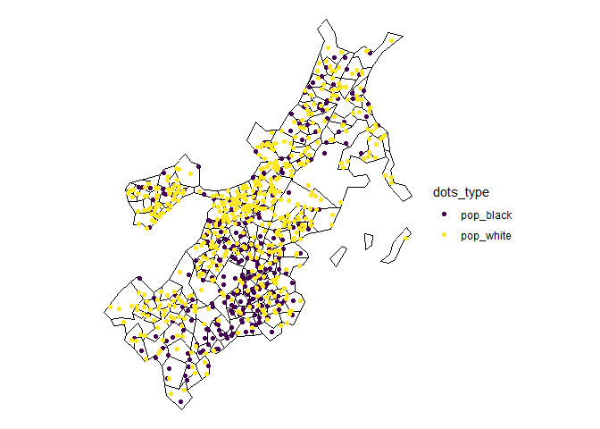

<!-- README.md is generated from README.Rmd. Please edit that file -->

# dots 

<!-- badges: start -->

[](https://github.com/christopherkenny/dots/actions/workflows/R-CMD-check.yaml)
<!-- badges: end -->

`dots` provides tools to make dot density maps.

## Installation

You can install the development version of dots from
[GitHub](https://github.com/) with:

``` r
remotes::install_github('christopherkenny/dots')
```

## Example

The main function in `dots` is `dots()`.

``` r
library(dots)
library(sf)
#> Linking to GEOS 3.11.2, GDAL 3.6.2, PROJ 9.2.0; sf_use_s2() is TRUE
library(ggplot2)
data('suffolk')
dots::dots(suffolk, c(pop_black, pop_white), divisor = 1000, engine = engine_sf_random) + 
  scale_color_viridis_d() + 
  theme_void()
#> Warning in min(cc[[1]], na.rm = TRUE): no non-missing arguments to min;
#> returning Inf
#> Warning in min(cc[[2]], na.rm = TRUE): no non-missing arguments to min;
#> returning Inf
#> Warning in max(cc[[1]], na.rm = TRUE): no non-missing arguments to max;
#> returning -Inf
#> Warning in max(cc[[2]], na.rm = TRUE): no non-missing arguments to max;
#> returning -Inf
#> Warning in min(cc[[1]], na.rm = TRUE): no non-missing arguments to min;
#> returning Inf
#> Warning in min(cc[[2]], na.rm = TRUE): no non-missing arguments to min;
#> returning Inf
#> Warning in max(cc[[1]], na.rm = TRUE): no non-missing arguments to max;
#> returning -Inf
#> Warning in max(cc[[2]], na.rm = TRUE): no non-missing arguments to max;
#> returning -Inf
#> Warning in min(cc[[1]], na.rm = TRUE): no non-missing arguments to min;
#> returning Inf
#> Warning in min(cc[[2]], na.rm = TRUE): no non-missing arguments to min;
#> returning Inf
#> Warning in max(cc[[1]], na.rm = TRUE): no non-missing arguments to max;
#> returning -Inf
#> Warning in max(cc[[2]], na.rm = TRUE): no non-missing arguments to max;
#> returning -Inf
#> Warning in min(cc[[1]], na.rm = TRUE): no non-missing arguments to min;
#> returning Inf
#> Warning in min(cc[[2]], na.rm = TRUE): no non-missing arguments to min;
#> returning Inf
#> Warning in max(cc[[1]], na.rm = TRUE): no non-missing arguments to max;
#> returning -Inf
#> Warning in max(cc[[2]], na.rm = TRUE): no non-missing arguments to max;
#> returning -Inf
#> Warning in min(cc[[1]], na.rm = TRUE): no non-missing arguments to min;
#> returning Inf
#> Warning in min(cc[[2]], na.rm = TRUE): no non-missing arguments to min;
#> returning Inf
#> Warning in max(cc[[1]], na.rm = TRUE): no non-missing arguments to max;
#> returning -Inf
#> Warning in max(cc[[2]], na.rm = TRUE): no non-missing arguments to max;
#> returning -Inf
#> Warning in min(cc[[1]], na.rm = TRUE): no non-missing arguments to min;
#> returning Inf
#> Warning in min(cc[[2]], na.rm = TRUE): no non-missing arguments to min;
#> returning Inf
#> Warning in max(cc[[1]], na.rm = TRUE): no non-missing arguments to max;
#> returning -Inf
#> Warning in max(cc[[2]], na.rm = TRUE): no non-missing arguments to max;
#> returning -Inf
#> Warning in min(cc[[1]], na.rm = TRUE): no non-missing arguments to min;
#> returning Inf
#> Warning in min(cc[[2]], na.rm = TRUE): no non-missing arguments to min;
#> returning Inf
#> Warning in max(cc[[1]], na.rm = TRUE): no non-missing arguments to max;
#> returning -Inf
#> Warning in max(cc[[2]], na.rm = TRUE): no non-missing arguments to max;
#> returning -Inf
#> Warning in min(cc[[1]], na.rm = TRUE): no non-missing arguments to min;
#> returning Inf
#> Warning in min(cc[[2]], na.rm = TRUE): no non-missing arguments to min;
#> returning Inf
#> Warning in max(cc[[1]], na.rm = TRUE): no non-missing arguments to max;
#> returning -Inf
#> Warning in max(cc[[2]], na.rm = TRUE): no non-missing arguments to max;
#> returning -Inf
#> Warning in min(cc[[1]], na.rm = TRUE): no non-missing arguments to min;
#> returning Inf
#> Warning in min(cc[[2]], na.rm = TRUE): no non-missing arguments to min;
#> returning Inf
#> Warning in max(cc[[1]], na.rm = TRUE): no non-missing arguments to max;
#> returning -Inf
#> Warning in max(cc[[2]], na.rm = TRUE): no non-missing arguments to max;
#> returning -Inf
#> Warning in min(cc[[1]], na.rm = TRUE): no non-missing arguments to min;
#> returning Inf
#> Warning in min(cc[[2]], na.rm = TRUE): no non-missing arguments to min;
#> returning Inf
#> Warning in max(cc[[1]], na.rm = TRUE): no non-missing arguments to max;
#> returning -Inf
#> Warning in max(cc[[2]], na.rm = TRUE): no non-missing arguments to max;
#> returning -Inf
#> Warning in min(cc[[1]], na.rm = TRUE): no non-missing arguments to min;
#> returning Inf
#> Warning in min(cc[[2]], na.rm = TRUE): no non-missing arguments to min;
#> returning Inf
#> Warning in max(cc[[1]], na.rm = TRUE): no non-missing arguments to max;
#> returning -Inf
#> Warning in max(cc[[2]], na.rm = TRUE): no non-missing arguments to max;
#> returning -Inf
#> Warning in min(cc[[1]], na.rm = TRUE): no non-missing arguments to min;
#> returning Inf
#> Warning in min(cc[[2]], na.rm = TRUE): no non-missing arguments to min;
#> returning Inf
#> Warning in max(cc[[1]], na.rm = TRUE): no non-missing arguments to max;
#> returning -Inf
#> Warning in max(cc[[2]], na.rm = TRUE): no non-missing arguments to max;
#> returning -Inf
#> Warning in min(cc[[1]], na.rm = TRUE): no non-missing arguments to min;
#> returning Inf
#> Warning in min(cc[[2]], na.rm = TRUE): no non-missing arguments to min;
#> returning Inf
#> Warning in max(cc[[1]], na.rm = TRUE): no non-missing arguments to max;
#> returning -Inf
#> Warning in max(cc[[2]], na.rm = TRUE): no non-missing arguments to max;
#> returning -Inf
#> Warning in min(cc[[1]], na.rm = TRUE): no non-missing arguments to min;
#> returning Inf
#> Warning in min(cc[[2]], na.rm = TRUE): no non-missing arguments to min;
#> returning Inf
#> Warning in max(cc[[1]], na.rm = TRUE): no non-missing arguments to max;
#> returning -Inf
#> Warning in max(cc[[2]], na.rm = TRUE): no non-missing arguments to max;
#> returning -Inf
#> Warning in min(cc[[1]], na.rm = TRUE): no non-missing arguments to min;
#> returning Inf
#> Warning in min(cc[[2]], na.rm = TRUE): no non-missing arguments to min;
#> returning Inf
#> Warning in max(cc[[1]], na.rm = TRUE): no non-missing arguments to max;
#> returning -Inf
#> Warning in max(cc[[2]], na.rm = TRUE): no non-missing arguments to max;
#> returning -Inf
#> Warning in min(cc[[1]], na.rm = TRUE): no non-missing arguments to min;
#> returning Inf
#> Warning in min(cc[[2]], na.rm = TRUE): no non-missing arguments to min;
#> returning Inf
#> Warning in max(cc[[1]], na.rm = TRUE): no non-missing arguments to max;
#> returning -Inf
#> Warning in max(cc[[2]], na.rm = TRUE): no non-missing arguments to max;
#> returning -Inf
#> Warning in min(cc[[1]], na.rm = TRUE): no non-missing arguments to min;
#> returning Inf
#> Warning in min(cc[[2]], na.rm = TRUE): no non-missing arguments to min;
#> returning Inf
#> Warning in max(cc[[1]], na.rm = TRUE): no non-missing arguments to max;
#> returning -Inf
#> Warning in max(cc[[2]], na.rm = TRUE): no non-missing arguments to max;
#> returning -Inf
#> Warning in min(cc[[1]], na.rm = TRUE): no non-missing arguments to min;
#> returning Inf
#> Warning in min(cc[[2]], na.rm = TRUE): no non-missing arguments to min;
#> returning Inf
#> Warning in max(cc[[1]], na.rm = TRUE): no non-missing arguments to max;
#> returning -Inf
#> Warning in max(cc[[2]], na.rm = TRUE): no non-missing arguments to max;
#> returning -Inf
#> Warning in min(cc[[1]], na.rm = TRUE): no non-missing arguments to min;
#> returning Inf
#> Warning in min(cc[[2]], na.rm = TRUE): no non-missing arguments to min;
#> returning Inf
#> Warning in max(cc[[1]], na.rm = TRUE): no non-missing arguments to max;
#> returning -Inf
#> Warning in max(cc[[2]], na.rm = TRUE): no non-missing arguments to max;
#> returning -Inf
#> Warning in min(cc[[1]], na.rm = TRUE): no non-missing arguments to min;
#> returning Inf
#> Warning in min(cc[[2]], na.rm = TRUE): no non-missing arguments to min;
#> returning Inf
#> Warning in max(cc[[1]], na.rm = TRUE): no non-missing arguments to max;
#> returning -Inf
#> Warning in max(cc[[2]], na.rm = TRUE): no non-missing arguments to max;
#> returning -Inf
#> Warning in min(cc[[1]], na.rm = TRUE): no non-missing arguments to min;
#> returning Inf
#> Warning in min(cc[[2]], na.rm = TRUE): no non-missing arguments to min;
#> returning Inf
#> Warning in max(cc[[1]], na.rm = TRUE): no non-missing arguments to max;
#> returning -Inf
#> Warning in max(cc[[2]], na.rm = TRUE): no non-missing arguments to max;
#> returning -Inf
#> Warning in min(cc[[1]], na.rm = TRUE): no non-missing arguments to min;
#> returning Inf
#> Warning in min(cc[[2]], na.rm = TRUE): no non-missing arguments to min;
#> returning Inf
#> Warning in max(cc[[1]], na.rm = TRUE): no non-missing arguments to max;
#> returning -Inf
#> Warning in max(cc[[2]], na.rm = TRUE): no non-missing arguments to max;
#> returning -Inf
#> Warning in min(cc[[1]], na.rm = TRUE): no non-missing arguments to min;
#> returning Inf
#> Warning in min(cc[[2]], na.rm = TRUE): no non-missing arguments to min;
#> returning Inf
#> Warning in max(cc[[1]], na.rm = TRUE): no non-missing arguments to max;
#> returning -Inf
#> Warning in max(cc[[2]], na.rm = TRUE): no non-missing arguments to max;
#> returning -Inf
#> Warning in min(cc[[1]], na.rm = TRUE): no non-missing arguments to min;
#> returning Inf
#> Warning in min(cc[[2]], na.rm = TRUE): no non-missing arguments to min;
#> returning Inf
#> Warning in max(cc[[1]], na.rm = TRUE): no non-missing arguments to max;
#> returning -Inf
#> Warning in max(cc[[2]], na.rm = TRUE): no non-missing arguments to max;
#> returning -Inf
#> Warning in min(cc[[1]], na.rm = TRUE): no non-missing arguments to min;
#> returning Inf
#> Warning in min(cc[[2]], na.rm = TRUE): no non-missing arguments to min;
#> returning Inf
#> Warning in max(cc[[1]], na.rm = TRUE): no non-missing arguments to max;
#> returning -Inf
#> Warning in max(cc[[2]], na.rm = TRUE): no non-missing arguments to max;
#> returning -Inf
#> Warning in min(cc[[1]], na.rm = TRUE): no non-missing arguments to min;
#> returning Inf
#> Warning in min(cc[[2]], na.rm = TRUE): no non-missing arguments to min;
#> returning Inf
#> Warning in max(cc[[1]], na.rm = TRUE): no non-missing arguments to max;
#> returning -Inf
#> Warning in max(cc[[2]], na.rm = TRUE): no non-missing arguments to max;
#> returning -Inf
#> Warning in min(cc[[1]], na.rm = TRUE): no non-missing arguments to min;
#> returning Inf
#> Warning in min(cc[[2]], na.rm = TRUE): no non-missing arguments to min;
#> returning Inf
#> Warning in max(cc[[1]], na.rm = TRUE): no non-missing arguments to max;
#> returning -Inf
#> Warning in max(cc[[2]], na.rm = TRUE): no non-missing arguments to max;
#> returning -Inf
#> Warning in min(cc[[1]], na.rm = TRUE): no non-missing arguments to min;
#> returning Inf
#> Warning in min(cc[[2]], na.rm = TRUE): no non-missing arguments to min;
#> returning Inf
#> Warning in max(cc[[1]], na.rm = TRUE): no non-missing arguments to max;
#> returning -Inf
#> Warning in max(cc[[2]], na.rm = TRUE): no non-missing arguments to max;
#> returning -Inf
#> Warning in min(cc[[1]], na.rm = TRUE): no non-missing arguments to min;
#> returning Inf
#> Warning in min(cc[[2]], na.rm = TRUE): no non-missing arguments to min;
#> returning Inf
#> Warning in max(cc[[1]], na.rm = TRUE): no non-missing arguments to max;
#> returning -Inf
#> Warning in max(cc[[2]], na.rm = TRUE): no non-missing arguments to max;
#> returning -Inf
#> Warning in min(cc[[1]], na.rm = TRUE): no non-missing arguments to min;
#> returning Inf
#> Warning in min(cc[[2]], na.rm = TRUE): no non-missing arguments to min;
#> returning Inf
#> Warning in max(cc[[1]], na.rm = TRUE): no non-missing arguments to max;
#> returning -Inf
#> Warning in max(cc[[2]], na.rm = TRUE): no non-missing arguments to max;
#> returning -Inf
#> Warning in min(cc[[1]], na.rm = TRUE): no non-missing arguments to min;
#> returning Inf
#> Warning in min(cc[[2]], na.rm = TRUE): no non-missing arguments to min;
#> returning Inf
#> Warning in max(cc[[1]], na.rm = TRUE): no non-missing arguments to max;
#> returning -Inf
#> Warning in max(cc[[2]], na.rm = TRUE): no non-missing arguments to max;
#> returning -Inf
#> Warning in min(cc[[1]], na.rm = TRUE): no non-missing arguments to min;
#> returning Inf
#> Warning in min(cc[[2]], na.rm = TRUE): no non-missing arguments to min;
#> returning Inf
#> Warning in max(cc[[1]], na.rm = TRUE): no non-missing arguments to max;
#> returning -Inf
#> Warning in max(cc[[2]], na.rm = TRUE): no non-missing arguments to max;
#> returning -Inf
#> Warning in min(cc[[1]], na.rm = TRUE): no non-missing arguments to min;
#> returning Inf
#> Warning in min(cc[[2]], na.rm = TRUE): no non-missing arguments to min;
#> returning Inf
#> Warning in max(cc[[1]], na.rm = TRUE): no non-missing arguments to max;
#> returning -Inf
#> Warning in max(cc[[2]], na.rm = TRUE): no non-missing arguments to max;
#> returning -Inf
#> Warning in min(cc[[1]], na.rm = TRUE): no non-missing arguments to min;
#> returning Inf
#> Warning in min(cc[[2]], na.rm = TRUE): no non-missing arguments to min;
#> returning Inf
#> Warning in max(cc[[1]], na.rm = TRUE): no non-missing arguments to max;
#> returning -Inf
#> Warning in max(cc[[2]], na.rm = TRUE): no non-missing arguments to max;
#> returning -Inf
#> Warning in min(cc[[1]], na.rm = TRUE): no non-missing arguments to min;
#> returning Inf
#> Warning in min(cc[[2]], na.rm = TRUE): no non-missing arguments to min;
#> returning Inf
#> Warning in max(cc[[1]], na.rm = TRUE): no non-missing arguments to max;
#> returning -Inf
#> Warning in max(cc[[2]], na.rm = TRUE): no non-missing arguments to max;
#> returning -Inf
#> Warning in min(cc[[1]], na.rm = TRUE): no non-missing arguments to min;
#> returning Inf
#> Warning in min(cc[[2]], na.rm = TRUE): no non-missing arguments to min;
#> returning Inf
#> Warning in max(cc[[1]], na.rm = TRUE): no non-missing arguments to max;
#> returning -Inf
#> Warning in max(cc[[2]], na.rm = TRUE): no non-missing arguments to max;
#> returning -Inf
#> Warning in min(cc[[1]], na.rm = TRUE): no non-missing arguments to min;
#> returning Inf
#> Warning in min(cc[[2]], na.rm = TRUE): no non-missing arguments to min;
#> returning Inf
#> Warning in max(cc[[1]], na.rm = TRUE): no non-missing arguments to max;
#> returning -Inf
#> Warning in max(cc[[2]], na.rm = TRUE): no non-missing arguments to max;
#> returning -Inf
#> Warning in min(cc[[1]], na.rm = TRUE): no non-missing arguments to min;
#> returning Inf
#> Warning in min(cc[[2]], na.rm = TRUE): no non-missing arguments to min;
#> returning Inf
#> Warning in max(cc[[1]], na.rm = TRUE): no non-missing arguments to max;
#> returning -Inf
#> Warning in max(cc[[2]], na.rm = TRUE): no non-missing arguments to max;
#> returning -Inf
#> Warning in min(cc[[1]], na.rm = TRUE): no non-missing arguments to min;
#> returning Inf
#> Warning in min(cc[[2]], na.rm = TRUE): no non-missing arguments to min;
#> returning Inf
#> Warning in max(cc[[1]], na.rm = TRUE): no non-missing arguments to max;
#> returning -Inf
#> Warning in max(cc[[2]], na.rm = TRUE): no non-missing arguments to max;
#> returning -Inf
#> Warning in min(cc[[1]], na.rm = TRUE): no non-missing arguments to min;
#> returning Inf
#> Warning in min(cc[[2]], na.rm = TRUE): no non-missing arguments to min;
#> returning Inf
#> Warning in max(cc[[1]], na.rm = TRUE): no non-missing arguments to max;
#> returning -Inf
#> Warning in max(cc[[2]], na.rm = TRUE): no non-missing arguments to max;
#> returning -Inf
#> Warning in min(cc[[1]], na.rm = TRUE): no non-missing arguments to min;
#> returning Inf
#> Warning in min(cc[[2]], na.rm = TRUE): no non-missing arguments to min;
#> returning Inf
#> Warning in max(cc[[1]], na.rm = TRUE): no non-missing arguments to max;
#> returning -Inf
#> Warning in max(cc[[2]], na.rm = TRUE): no non-missing arguments to max;
#> returning -Inf
#> Warning in min(cc[[1]], na.rm = TRUE): no non-missing arguments to min;
#> returning Inf
#> Warning in min(cc[[2]], na.rm = TRUE): no non-missing arguments to min;
#> returning Inf
#> Warning in max(cc[[1]], na.rm = TRUE): no non-missing arguments to max;
#> returning -Inf
#> Warning in max(cc[[2]], na.rm = TRUE): no non-missing arguments to max;
#> returning -Inf
#> Warning in min(cc[[1]], na.rm = TRUE): no non-missing arguments to min;
#> returning Inf
#> Warning in min(cc[[2]], na.rm = TRUE): no non-missing arguments to min;
#> returning Inf
#> Warning in max(cc[[1]], na.rm = TRUE): no non-missing arguments to max;
#> returning -Inf
#> Warning in max(cc[[2]], na.rm = TRUE): no non-missing arguments to max;
#> returning -Inf
#> Warning in min(cc[[1]], na.rm = TRUE): no non-missing arguments to min;
#> returning Inf
#> Warning in min(cc[[2]], na.rm = TRUE): no non-missing arguments to min;
#> returning Inf
#> Warning in max(cc[[1]], na.rm = TRUE): no non-missing arguments to max;
#> returning -Inf
#> Warning in max(cc[[2]], na.rm = TRUE): no non-missing arguments to max;
#> returning -Inf
#> Warning in min(cc[[1]], na.rm = TRUE): no non-missing arguments to min;
#> returning Inf
#> Warning in min(cc[[2]], na.rm = TRUE): no non-missing arguments to min;
#> returning Inf
#> Warning in max(cc[[1]], na.rm = TRUE): no non-missing arguments to max;
#> returning -Inf
#> Warning in max(cc[[2]], na.rm = TRUE): no non-missing arguments to max;
#> returning -Inf
#> Warning in min(cc[[1]], na.rm = TRUE): no non-missing arguments to min;
#> returning Inf
#> Warning in min(cc[[2]], na.rm = TRUE): no non-missing arguments to min;
#> returning Inf
#> Warning in max(cc[[1]], na.rm = TRUE): no non-missing arguments to max;
#> returning -Inf
#> Warning in max(cc[[2]], na.rm = TRUE): no non-missing arguments to max;
#> returning -Inf
#> Warning in min(cc[[1]], na.rm = TRUE): no non-missing arguments to min;
#> returning Inf
#> Warning in min(cc[[2]], na.rm = TRUE): no non-missing arguments to min;
#> returning Inf
#> Warning in max(cc[[1]], na.rm = TRUE): no non-missing arguments to max;
#> returning -Inf
#> Warning in max(cc[[2]], na.rm = TRUE): no non-missing arguments to max;
#> returning -Inf
#> Warning in min(cc[[1]], na.rm = TRUE): no non-missing arguments to min;
#> returning Inf
#> Warning in min(cc[[2]], na.rm = TRUE): no non-missing arguments to min;
#> returning Inf
#> Warning in max(cc[[1]], na.rm = TRUE): no non-missing arguments to max;
#> returning -Inf
#> Warning in max(cc[[2]], na.rm = TRUE): no non-missing arguments to max;
#> returning -Inf
#> Warning in min(cc[[1]], na.rm = TRUE): no non-missing arguments to min;
#> returning Inf
#> Warning in min(cc[[2]], na.rm = TRUE): no non-missing arguments to min;
#> returning Inf
#> Warning in max(cc[[1]], na.rm = TRUE): no non-missing arguments to max;
#> returning -Inf
#> Warning in max(cc[[2]], na.rm = TRUE): no non-missing arguments to max;
#> returning -Inf
#> Warning in min(cc[[1]], na.rm = TRUE): no non-missing arguments to min;
#> returning Inf
#> Warning in min(cc[[2]], na.rm = TRUE): no non-missing arguments to min;
#> returning Inf
#> Warning in max(cc[[1]], na.rm = TRUE): no non-missing arguments to max;
#> returning -Inf
#> Warning in max(cc[[2]], na.rm = TRUE): no non-missing arguments to max;
#> returning -Inf
#> Warning in min(cc[[1]], na.rm = TRUE): no non-missing arguments to min;
#> returning Inf
#> Warning in min(cc[[2]], na.rm = TRUE): no non-missing arguments to min;
#> returning Inf
#> Warning in max(cc[[1]], na.rm = TRUE): no non-missing arguments to max;
#> returning -Inf
#> Warning in max(cc[[2]], na.rm = TRUE): no non-missing arguments to max;
#> returning -Inf
#> Warning in min(cc[[1]], na.rm = TRUE): no non-missing arguments to min;
#> returning Inf
#> Warning in min(cc[[2]], na.rm = TRUE): no non-missing arguments to min;
#> returning Inf
#> Warning in max(cc[[1]], na.rm = TRUE): no non-missing arguments to max;
#> returning -Inf
#> Warning in max(cc[[2]], na.rm = TRUE): no non-missing arguments to max;
#> returning -Inf
#> Warning in min(cc[[1]], na.rm = TRUE): no non-missing arguments to min;
#> returning Inf
#> Warning in min(cc[[2]], na.rm = TRUE): no non-missing arguments to min;
#> returning Inf
#> Warning in max(cc[[1]], na.rm = TRUE): no non-missing arguments to max;
#> returning -Inf
#> Warning in max(cc[[2]], na.rm = TRUE): no non-missing arguments to max;
#> returning -Inf
#> Warning in min(cc[[1]], na.rm = TRUE): no non-missing arguments to min;
#> returning Inf
#> Warning in min(cc[[2]], na.rm = TRUE): no non-missing arguments to min;
#> returning Inf
#> Warning in max(cc[[1]], na.rm = TRUE): no non-missing arguments to max;
#> returning -Inf
#> Warning in max(cc[[2]], na.rm = TRUE): no non-missing arguments to max;
#> returning -Inf
#> Warning in min(cc[[1]], na.rm = TRUE): no non-missing arguments to min;
#> returning Inf
#> Warning in min(cc[[2]], na.rm = TRUE): no non-missing arguments to min;
#> returning Inf
#> Warning in max(cc[[1]], na.rm = TRUE): no non-missing arguments to max;
#> returning -Inf
#> Warning in max(cc[[2]], na.rm = TRUE): no non-missing arguments to max;
#> returning -Inf
#> Warning in min(cc[[1]], na.rm = TRUE): no non-missing arguments to min;
#> returning Inf
#> Warning in min(cc[[2]], na.rm = TRUE): no non-missing arguments to min;
#> returning Inf
#> Warning in max(cc[[1]], na.rm = TRUE): no non-missing arguments to max;
#> returning -Inf
#> Warning in max(cc[[2]], na.rm = TRUE): no non-missing arguments to max;
#> returning -Inf
#> Warning in min(cc[[1]], na.rm = TRUE): no non-missing arguments to min;
#> returning Inf
#> Warning in min(cc[[2]], na.rm = TRUE): no non-missing arguments to min;
#> returning Inf
#> Warning in max(cc[[1]], na.rm = TRUE): no non-missing arguments to max;
#> returning -Inf
#> Warning in max(cc[[2]], na.rm = TRUE): no non-missing arguments to max;
#> returning -Inf
#> Warning in min(cc[[1]], na.rm = TRUE): no non-missing arguments to min;
#> returning Inf
#> Warning in min(cc[[2]], na.rm = TRUE): no non-missing arguments to min;
#> returning Inf
#> Warning in max(cc[[1]], na.rm = TRUE): no non-missing arguments to max;
#> returning -Inf
#> Warning in max(cc[[2]], na.rm = TRUE): no non-missing arguments to max;
#> returning -Inf
#> Warning in min(cc[[1]], na.rm = TRUE): no non-missing arguments to min;
#> returning Inf
#> Warning in min(cc[[2]], na.rm = TRUE): no non-missing arguments to min;
#> returning Inf
#> Warning in max(cc[[1]], na.rm = TRUE): no non-missing arguments to max;
#> returning -Inf
#> Warning in max(cc[[2]], na.rm = TRUE): no non-missing arguments to max;
#> returning -Inf
#> Warning in min(cc[[1]], na.rm = TRUE): no non-missing arguments to min;
#> returning Inf
#> Warning in min(cc[[2]], na.rm = TRUE): no non-missing arguments to min;
#> returning Inf
#> Warning in max(cc[[1]], na.rm = TRUE): no non-missing arguments to max;
#> returning -Inf
#> Warning in max(cc[[2]], na.rm = TRUE): no non-missing arguments to max;
#> returning -Inf
#> Warning in min(cc[[1]], na.rm = TRUE): no non-missing arguments to min;
#> returning Inf
#> Warning in min(cc[[2]], na.rm = TRUE): no non-missing arguments to min;
#> returning Inf
#> Warning in max(cc[[1]], na.rm = TRUE): no non-missing arguments to max;
#> returning -Inf
#> Warning in max(cc[[2]], na.rm = TRUE): no non-missing arguments to max;
#> returning -Inf
#> Warning in min(cc[[1]], na.rm = TRUE): no non-missing arguments to min;
#> returning Inf
#> Warning in min(cc[[2]], na.rm = TRUE): no non-missing arguments to min;
#> returning Inf
#> Warning in max(cc[[1]], na.rm = TRUE): no non-missing arguments to max;
#> returning -Inf
#> Warning in max(cc[[2]], na.rm = TRUE): no non-missing arguments to max;
#> returning -Inf
#> Warning in min(cc[[1]], na.rm = TRUE): no non-missing arguments to min;
#> returning Inf
#> Warning in min(cc[[2]], na.rm = TRUE): no non-missing arguments to min;
#> returning Inf
#> Warning in max(cc[[1]], na.rm = TRUE): no non-missing arguments to max;
#> returning -Inf
#> Warning in max(cc[[2]], na.rm = TRUE): no non-missing arguments to max;
#> returning -Inf
#> Warning in min(cc[[1]], na.rm = TRUE): no non-missing arguments to min;
#> returning Inf
#> Warning in min(cc[[2]], na.rm = TRUE): no non-missing arguments to min;
#> returning Inf
#> Warning in max(cc[[1]], na.rm = TRUE): no non-missing arguments to max;
#> returning -Inf
#> Warning in max(cc[[2]], na.rm = TRUE): no non-missing arguments to max;
#> returning -Inf
#> Warning in min(cc[[1]], na.rm = TRUE): no non-missing arguments to min;
#> returning Inf
#> Warning in min(cc[[2]], na.rm = TRUE): no non-missing arguments to min;
#> returning Inf
#> Warning in max(cc[[1]], na.rm = TRUE): no non-missing arguments to max;
#> returning -Inf
#> Warning in max(cc[[2]], na.rm = TRUE): no non-missing arguments to max;
#> returning -Inf
#> Warning in min(cc[[1]], na.rm = TRUE): no non-missing arguments to min;
#> returning Inf
#> Warning in min(cc[[2]], na.rm = TRUE): no non-missing arguments to min;
#> returning Inf
#> Warning in max(cc[[1]], na.rm = TRUE): no non-missing arguments to max;
#> returning -Inf
#> Warning in max(cc[[2]], na.rm = TRUE): no non-missing arguments to max;
#> returning -Inf
#> Warning in min(cc[[1]], na.rm = TRUE): no non-missing arguments to min;
#> returning Inf
#> Warning in min(cc[[2]], na.rm = TRUE): no non-missing arguments to min;
#> returning Inf
#> Warning in max(cc[[1]], na.rm = TRUE): no non-missing arguments to max;
#> returning -Inf
#> Warning in max(cc[[2]], na.rm = TRUE): no non-missing arguments to max;
#> returning -Inf
#> Warning in min(cc[[1]], na.rm = TRUE): no non-missing arguments to min;
#> returning Inf
#> Warning in min(cc[[2]], na.rm = TRUE): no non-missing arguments to min;
#> returning Inf
#> Warning in max(cc[[1]], na.rm = TRUE): no non-missing arguments to max;
#> returning -Inf
#> Warning in max(cc[[2]], na.rm = TRUE): no non-missing arguments to max;
#> returning -Inf
#> Warning in min(cc[[1]], na.rm = TRUE): no non-missing arguments to min;
#> returning Inf
#> Warning in min(cc[[2]], na.rm = TRUE): no non-missing arguments to min;
#> returning Inf
#> Warning in max(cc[[1]], na.rm = TRUE): no non-missing arguments to max;
#> returning -Inf
#> Warning in max(cc[[2]], na.rm = TRUE): no non-missing arguments to max;
#> returning -Inf
#> Warning in min(cc[[1]], na.rm = TRUE): no non-missing arguments to min;
#> returning Inf
#> Warning in min(cc[[2]], na.rm = TRUE): no non-missing arguments to min;
#> returning Inf
#> Warning in max(cc[[1]], na.rm = TRUE): no non-missing arguments to max;
#> returning -Inf
#> Warning in max(cc[[2]], na.rm = TRUE): no non-missing arguments to max;
#> returning -Inf
#> Warning in min(cc[[1]], na.rm = TRUE): no non-missing arguments to min;
#> returning Inf
#> Warning in min(cc[[2]], na.rm = TRUE): no non-missing arguments to min;
#> returning Inf
#> Warning in max(cc[[1]], na.rm = TRUE): no non-missing arguments to max;
#> returning -Inf
#> Warning in max(cc[[2]], na.rm = TRUE): no non-missing arguments to max;
#> returning -Inf
#> Warning in min(cc[[1]], na.rm = TRUE): no non-missing arguments to min;
#> returning Inf
#> Warning in min(cc[[2]], na.rm = TRUE): no non-missing arguments to min;
#> returning Inf
#> Warning in max(cc[[1]], na.rm = TRUE): no non-missing arguments to max;
#> returning -Inf
#> Warning in max(cc[[2]], na.rm = TRUE): no non-missing arguments to max;
#> returning -Inf
#> Warning in min(cc[[1]], na.rm = TRUE): no non-missing arguments to min;
#> returning Inf
#> Warning in min(cc[[2]], na.rm = TRUE): no non-missing arguments to min;
#> returning Inf
#> Warning in max(cc[[1]], na.rm = TRUE): no non-missing arguments to max;
#> returning -Inf
#> Warning in max(cc[[2]], na.rm = TRUE): no non-missing arguments to max;
#> returning -Inf
#> Warning in min(cc[[1]], na.rm = TRUE): no non-missing arguments to min;
#> returning Inf
#> Warning in min(cc[[2]], na.rm = TRUE): no non-missing arguments to min;
#> returning Inf
#> Warning in max(cc[[1]], na.rm = TRUE): no non-missing arguments to max;
#> returning -Inf
#> Warning in max(cc[[2]], na.rm = TRUE): no non-missing arguments to max;
#> returning -Inf
#> Warning in min(cc[[1]], na.rm = TRUE): no non-missing arguments to min;
#> returning Inf
#> Warning in min(cc[[2]], na.rm = TRUE): no non-missing arguments to min;
#> returning Inf
#> Warning in max(cc[[1]], na.rm = TRUE): no non-missing arguments to max;
#> returning -Inf
#> Warning in max(cc[[2]], na.rm = TRUE): no non-missing arguments to max;
#> returning -Inf
#> Warning in min(cc[[1]], na.rm = TRUE): no non-missing arguments to min;
#> returning Inf
#> Warning in min(cc[[2]], na.rm = TRUE): no non-missing arguments to min;
#> returning Inf
#> Warning in max(cc[[1]], na.rm = TRUE): no non-missing arguments to max;
#> returning -Inf
#> Warning in max(cc[[2]], na.rm = TRUE): no non-missing arguments to max;
#> returning -Inf
#> Warning in min(cc[[1]], na.rm = TRUE): no non-missing arguments to min;
#> returning Inf
#> Warning in min(cc[[2]], na.rm = TRUE): no non-missing arguments to min;
#> returning Inf
#> Warning in max(cc[[1]], na.rm = TRUE): no non-missing arguments to max;
#> returning -Inf
#> Warning in max(cc[[2]], na.rm = TRUE): no non-missing arguments to max;
#> returning -Inf
#> Warning in min(cc[[1]], na.rm = TRUE): no non-missing arguments to min;
#> returning Inf
#> Warning in min(cc[[2]], na.rm = TRUE): no non-missing arguments to min;
#> returning Inf
#> Warning in max(cc[[1]], na.rm = TRUE): no non-missing arguments to max;
#> returning -Inf
#> Warning in max(cc[[2]], na.rm = TRUE): no non-missing arguments to max;
#> returning -Inf
#> Warning in min(cc[[1]], na.rm = TRUE): no non-missing arguments to min;
#> returning Inf
#> Warning in min(cc[[2]], na.rm = TRUE): no non-missing arguments to min;
#> returning Inf
#> Warning in max(cc[[1]], na.rm = TRUE): no non-missing arguments to max;
#> returning -Inf
#> Warning in max(cc[[2]], na.rm = TRUE): no non-missing arguments to max;
#> returning -Inf
#> Warning in min(cc[[1]], na.rm = TRUE): no non-missing arguments to min;
#> returning Inf
#> Warning in min(cc[[2]], na.rm = TRUE): no non-missing arguments to min;
#> returning Inf
#> Warning in max(cc[[1]], na.rm = TRUE): no non-missing arguments to max;
#> returning -Inf
#> Warning in max(cc[[2]], na.rm = TRUE): no non-missing arguments to max;
#> returning -Inf
#> Warning in min(cc[[1]], na.rm = TRUE): no non-missing arguments to min;
#> returning Inf
#> Warning in min(cc[[2]], na.rm = TRUE): no non-missing arguments to min;
#> returning Inf
#> Warning in max(cc[[1]], na.rm = TRUE): no non-missing arguments to max;
#> returning -Inf
#> Warning in max(cc[[2]], na.rm = TRUE): no non-missing arguments to max;
#> returning -Inf
#> Warning in min(cc[[1]], na.rm = TRUE): no non-missing arguments to min;
#> returning Inf
#> Warning in min(cc[[2]], na.rm = TRUE): no non-missing arguments to min;
#> returning Inf
#> Warning in max(cc[[1]], na.rm = TRUE): no non-missing arguments to max;
#> returning -Inf
#> Warning in max(cc[[2]], na.rm = TRUE): no non-missing arguments to max;
#> returning -Inf
#> Warning in min(cc[[1]], na.rm = TRUE): no non-missing arguments to min;
#> returning Inf
#> Warning in min(cc[[2]], na.rm = TRUE): no non-missing arguments to min;
#> returning Inf
#> Warning in max(cc[[1]], na.rm = TRUE): no non-missing arguments to max;
#> returning -Inf
#> Warning in max(cc[[2]], na.rm = TRUE): no non-missing arguments to max;
#> returning -Inf
#> Warning in min(cc[[1]], na.rm = TRUE): no non-missing arguments to min;
#> returning Inf
#> Warning in min(cc[[2]], na.rm = TRUE): no non-missing arguments to min;
#> returning Inf
#> Warning in max(cc[[1]], na.rm = TRUE): no non-missing arguments to max;
#> returning -Inf
#> Warning in max(cc[[2]], na.rm = TRUE): no non-missing arguments to max;
#> returning -Inf
#> Warning in min(cc[[1]], na.rm = TRUE): no non-missing arguments to min;
#> returning Inf
#> Warning in min(cc[[2]], na.rm = TRUE): no non-missing arguments to min;
#> returning Inf
#> Warning in max(cc[[1]], na.rm = TRUE): no non-missing arguments to max;
#> returning -Inf
#> Warning in max(cc[[2]], na.rm = TRUE): no non-missing arguments to max;
#> returning -Inf
#> Warning in min(cc[[1]], na.rm = TRUE): no non-missing arguments to min;
#> returning Inf
#> Warning in min(cc[[2]], na.rm = TRUE): no non-missing arguments to min;
#> returning Inf
#> Warning in max(cc[[1]], na.rm = TRUE): no non-missing arguments to max;
#> returning -Inf
#> Warning in max(cc[[2]], na.rm = TRUE): no non-missing arguments to max;
#> returning -Inf
#> Warning in min(cc[[1]], na.rm = TRUE): no non-missing arguments to min;
#> returning Inf
#> Warning in min(cc[[2]], na.rm = TRUE): no non-missing arguments to min;
#> returning Inf
#> Warning in max(cc[[1]], na.rm = TRUE): no non-missing arguments to max;
#> returning -Inf
#> Warning in max(cc[[2]], na.rm = TRUE): no non-missing arguments to max;
#> returning -Inf
#> Warning in min(cc[[1]], na.rm = TRUE): no non-missing arguments to min;
#> returning Inf
#> Warning in min(cc[[2]], na.rm = TRUE): no non-missing arguments to min;
#> returning Inf
#> Warning in max(cc[[1]], na.rm = TRUE): no non-missing arguments to max;
#> returning -Inf
#> Warning in max(cc[[2]], na.rm = TRUE): no non-missing arguments to max;
#> returning -Inf
#> Warning in min(cc[[1]], na.rm = TRUE): no non-missing arguments to min;
#> returning Inf
#> Warning in min(cc[[2]], na.rm = TRUE): no non-missing arguments to min;
#> returning Inf
#> Warning in max(cc[[1]], na.rm = TRUE): no non-missing arguments to max;
#> returning -Inf
#> Warning in max(cc[[2]], na.rm = TRUE): no non-missing arguments to max;
#> returning -Inf
#> Warning in min(cc[[1]], na.rm = TRUE): no non-missing arguments to min;
#> returning Inf
#> Warning in min(cc[[2]], na.rm = TRUE): no non-missing arguments to min;
#> returning Inf
#> Warning in max(cc[[1]], na.rm = TRUE): no non-missing arguments to max;
#> returning -Inf
#> Warning in max(cc[[2]], na.rm = TRUE): no non-missing arguments to max;
#> returning -Inf
#> Warning in min(cc[[1]], na.rm = TRUE): no non-missing arguments to min;
#> returning Inf
#> Warning in min(cc[[2]], na.rm = TRUE): no non-missing arguments to min;
#> returning Inf
#> Warning in max(cc[[1]], na.rm = TRUE): no non-missing arguments to max;
#> returning -Inf
#> Warning in max(cc[[2]], na.rm = TRUE): no non-missing arguments to max;
#> returning -Inf
#> Warning in min(cc[[1]], na.rm = TRUE): no non-missing arguments to min;
#> returning Inf
#> Warning in min(cc[[2]], na.rm = TRUE): no non-missing arguments to min;
#> returning Inf
#> Warning in max(cc[[1]], na.rm = TRUE): no non-missing arguments to max;
#> returning -Inf
#> Warning in max(cc[[2]], na.rm = TRUE): no non-missing arguments to max;
#> returning -Inf
#> Warning in min(cc[[1]], na.rm = TRUE): no non-missing arguments to min;
#> returning Inf
#> Warning in min(cc[[2]], na.rm = TRUE): no non-missing arguments to min;
#> returning Inf
#> Warning in max(cc[[1]], na.rm = TRUE): no non-missing arguments to max;
#> returning -Inf
#> Warning in max(cc[[2]], na.rm = TRUE): no non-missing arguments to max;
#> returning -Inf
#> Warning in min(cc[[1]], na.rm = TRUE): no non-missing arguments to min;
#> returning Inf
#> Warning in min(cc[[2]], na.rm = TRUE): no non-missing arguments to min;
#> returning Inf
#> Warning in max(cc[[1]], na.rm = TRUE): no non-missing arguments to max;
#> returning -Inf
#> Warning in max(cc[[2]], na.rm = TRUE): no non-missing arguments to max;
#> returning -Inf
#> Warning in min(cc[[1]], na.rm = TRUE): no non-missing arguments to min;
#> returning Inf
#> Warning in min(cc[[2]], na.rm = TRUE): no non-missing arguments to min;
#> returning Inf
#> Warning in max(cc[[1]], na.rm = TRUE): no non-missing arguments to max;
#> returning -Inf
#> Warning in max(cc[[2]], na.rm = TRUE): no non-missing arguments to max;
#> returning -Inf
#> Warning in min(cc[[1]], na.rm = TRUE): no non-missing arguments to min;
#> returning Inf
#> Warning in min(cc[[2]], na.rm = TRUE): no non-missing arguments to min;
#> returning Inf
#> Warning in max(cc[[1]], na.rm = TRUE): no non-missing arguments to max;
#> returning -Inf
#> Warning in max(cc[[2]], na.rm = TRUE): no non-missing arguments to max;
#> returning -Inf
#> Warning in min(cc[[1]], na.rm = TRUE): no non-missing arguments to min;
#> returning Inf
#> Warning in min(cc[[2]], na.rm = TRUE): no non-missing arguments to min;
#> returning Inf
#> Warning in max(cc[[1]], na.rm = TRUE): no non-missing arguments to max;
#> returning -Inf
#> Warning in max(cc[[2]], na.rm = TRUE): no non-missing arguments to max;
#> returning -Inf
#> Warning in min(cc[[1]], na.rm = TRUE): no non-missing arguments to min;
#> returning Inf
#> Warning in min(cc[[2]], na.rm = TRUE): no non-missing arguments to min;
#> returning Inf
#> Warning in max(cc[[1]], na.rm = TRUE): no non-missing arguments to max;
#> returning -Inf
#> Warning in max(cc[[2]], na.rm = TRUE): no non-missing arguments to max;
#> returning -Inf
#> Warning in min(cc[[1]], na.rm = TRUE): no non-missing arguments to min;
#> returning Inf
#> Warning in min(cc[[2]], na.rm = TRUE): no non-missing arguments to min;
#> returning Inf
#> Warning in max(cc[[1]], na.rm = TRUE): no non-missing arguments to max;
#> returning -Inf
#> Warning in max(cc[[2]], na.rm = TRUE): no non-missing arguments to max;
#> returning -Inf
#> Warning in min(cc[[1]], na.rm = TRUE): no non-missing arguments to min;
#> returning Inf
#> Warning in min(cc[[2]], na.rm = TRUE): no non-missing arguments to min;
#> returning Inf
#> Warning in max(cc[[1]], na.rm = TRUE): no non-missing arguments to max;
#> returning -Inf
#> Warning in max(cc[[2]], na.rm = TRUE): no non-missing arguments to max;
#> returning -Inf
#> Warning in min(cc[[1]], na.rm = TRUE): no non-missing arguments to min;
#> returning Inf
#> Warning in min(cc[[2]], na.rm = TRUE): no non-missing arguments to min;
#> returning Inf
#> Warning in max(cc[[1]], na.rm = TRUE): no non-missing arguments to max;
#> returning -Inf
#> Warning in max(cc[[2]], na.rm = TRUE): no non-missing arguments to max;
#> returning -Inf
#> Warning in min(cc[[1]], na.rm = TRUE): no non-missing arguments to min;
#> returning Inf
#> Warning in min(cc[[2]], na.rm = TRUE): no non-missing arguments to min;
#> returning Inf
#> Warning in max(cc[[1]], na.rm = TRUE): no non-missing arguments to max;
#> returning -Inf
#> Warning in max(cc[[2]], na.rm = TRUE): no non-missing arguments to max;
#> returning -Inf
#> Warning in min(cc[[1]], na.rm = TRUE): no non-missing arguments to min;
#> returning Inf
#> Warning in min(cc[[2]], na.rm = TRUE): no non-missing arguments to min;
#> returning Inf
#> Warning in max(cc[[1]], na.rm = TRUE): no non-missing arguments to max;
#> returning -Inf
#> Warning in max(cc[[2]], na.rm = TRUE): no non-missing arguments to max;
#> returning -Inf
#> Warning in min(cc[[1]], na.rm = TRUE): no non-missing arguments to min;
#> returning Inf
#> Warning in min(cc[[2]], na.rm = TRUE): no non-missing arguments to min;
#> returning Inf
#> Warning in max(cc[[1]], na.rm = TRUE): no non-missing arguments to max;
#> returning -Inf
#> Warning in max(cc[[2]], na.rm = TRUE): no non-missing arguments to max;
#> returning -Inf
#> Warning in min(cc[[1]], na.rm = TRUE): no non-missing arguments to min;
#> returning Inf
#> Warning in min(cc[[2]], na.rm = TRUE): no non-missing arguments to min;
#> returning Inf
#> Warning in max(cc[[1]], na.rm = TRUE): no non-missing arguments to max;
#> returning -Inf
#> Warning in max(cc[[2]], na.rm = TRUE): no non-missing arguments to max;
#> returning -Inf
#> Warning in min(cc[[1]], na.rm = TRUE): no non-missing arguments to min;
#> returning Inf
#> Warning in min(cc[[2]], na.rm = TRUE): no non-missing arguments to min;
#> returning Inf
#> Warning in max(cc[[1]], na.rm = TRUE): no non-missing arguments to max;
#> returning -Inf
#> Warning in max(cc[[2]], na.rm = TRUE): no non-missing arguments to max;
#> returning -Inf
#> Warning in min(cc[[1]], na.rm = TRUE): no non-missing arguments to min;
#> returning Inf
#> Warning in min(cc[[2]], na.rm = TRUE): no non-missing arguments to min;
#> returning Inf
#> Warning in max(cc[[1]], na.rm = TRUE): no non-missing arguments to max;
#> returning -Inf
#> Warning in max(cc[[2]], na.rm = TRUE): no non-missing arguments to max;
#> returning -Inf
#> Warning in min(cc[[1]], na.rm = TRUE): no non-missing arguments to min;
#> returning Inf
#> Warning in min(cc[[2]], na.rm = TRUE): no non-missing arguments to min;
#> returning Inf
#> Warning in max(cc[[1]], na.rm = TRUE): no non-missing arguments to max;
#> returning -Inf
#> Warning in max(cc[[2]], na.rm = TRUE): no non-missing arguments to max;
#> returning -Inf
#> Warning in min(cc[[1]], na.rm = TRUE): no non-missing arguments to min;
#> returning Inf
#> Warning in min(cc[[2]], na.rm = TRUE): no non-missing arguments to min;
#> returning Inf
#> Warning in max(cc[[1]], na.rm = TRUE): no non-missing arguments to max;
#> returning -Inf
#> Warning in max(cc[[2]], na.rm = TRUE): no non-missing arguments to max;
#> returning -Inf
#> Warning in min(cc[[1]], na.rm = TRUE): no non-missing arguments to min;
#> returning Inf
#> Warning in min(cc[[2]], na.rm = TRUE): no non-missing arguments to min;
#> returning Inf
#> Warning in max(cc[[1]], na.rm = TRUE): no non-missing arguments to max;
#> returning -Inf
#> Warning in max(cc[[2]], na.rm = TRUE): no non-missing arguments to max;
#> returning -Inf
#> Warning in min(cc[[1]], na.rm = TRUE): no non-missing arguments to min;
#> returning Inf
#> Warning in min(cc[[2]], na.rm = TRUE): no non-missing arguments to min;
#> returning Inf
#> Warning in max(cc[[1]], na.rm = TRUE): no non-missing arguments to max;
#> returning -Inf
#> Warning in max(cc[[2]], na.rm = TRUE): no non-missing arguments to max;
#> returning -Inf
#> Warning in min(cc[[1]], na.rm = TRUE): no non-missing arguments to min;
#> returning Inf
#> Warning in min(cc[[2]], na.rm = TRUE): no non-missing arguments to min;
#> returning Inf
#> Warning in max(cc[[1]], na.rm = TRUE): no non-missing arguments to max;
#> returning -Inf
#> Warning in max(cc[[2]], na.rm = TRUE): no non-missing arguments to max;
#> returning -Inf
#> Warning in min(cc[[1]], na.rm = TRUE): no non-missing arguments to min;
#> returning Inf
#> Warning in min(cc[[2]], na.rm = TRUE): no non-missing arguments to min;
#> returning Inf
#> Warning in max(cc[[1]], na.rm = TRUE): no non-missing arguments to max;
#> returning -Inf
#> Warning in max(cc[[2]], na.rm = TRUE): no non-missing arguments to max;
#> returning -Inf
#> Warning in min(cc[[1]], na.rm = TRUE): no non-missing arguments to min;
#> returning Inf
#> Warning in min(cc[[2]], na.rm = TRUE): no non-missing arguments to min;
#> returning Inf
#> Warning in max(cc[[1]], na.rm = TRUE): no non-missing arguments to max;
#> returning -Inf
#> Warning in max(cc[[2]], na.rm = TRUE): no non-missing arguments to max;
#> returning -Inf
#> Warning in min(cc[[1]], na.rm = TRUE): no non-missing arguments to min;
#> returning Inf
#> Warning in min(cc[[2]], na.rm = TRUE): no non-missing arguments to min;
#> returning Inf
#> Warning in max(cc[[1]], na.rm = TRUE): no non-missing arguments to max;
#> returning -Inf
#> Warning in max(cc[[2]], na.rm = TRUE): no non-missing arguments to max;
#> returning -Inf
#> Warning in min(cc[[1]], na.rm = TRUE): no non-missing arguments to min;
#> returning Inf
#> Warning in min(cc[[2]], na.rm = TRUE): no non-missing arguments to min;
#> returning Inf
#> Warning in max(cc[[1]], na.rm = TRUE): no non-missing arguments to max;
#> returning -Inf
#> Warning in max(cc[[2]], na.rm = TRUE): no non-missing arguments to max;
#> returning -Inf
#> Warning in min(cc[[1]], na.rm = TRUE): no non-missing arguments to min;
#> returning Inf
#> Warning in min(cc[[2]], na.rm = TRUE): no non-missing arguments to min;
#> returning Inf
#> Warning in max(cc[[1]], na.rm = TRUE): no non-missing arguments to max;
#> returning -Inf
#> Warning in max(cc[[2]], na.rm = TRUE): no non-missing arguments to max;
#> returning -Inf
```



You can also use `dots_points()` to only make the randomized points.

``` r
dots::dots_points(suffolk, c(pop_black, pop_white), divisor = 1000, engine = engine_sf_random) |> 
  ggplot() + 
  geom_sf(data = suffolk) + 
  geom_sf(aes(color = dots_type)) + 
  scale_color_viridis_d() + 
  theme_void()
#> Warning in min(cc[[1]], na.rm = TRUE): no non-missing arguments to min;
#> returning Inf
#> Warning in min(cc[[2]], na.rm = TRUE): no non-missing arguments to min;
#> returning Inf
#> Warning in max(cc[[1]], na.rm = TRUE): no non-missing arguments to max;
#> returning -Inf
#> Warning in max(cc[[2]], na.rm = TRUE): no non-missing arguments to max;
#> returning -Inf
#> Warning in min(cc[[1]], na.rm = TRUE): no non-missing arguments to min;
#> returning Inf
#> Warning in min(cc[[2]], na.rm = TRUE): no non-missing arguments to min;
#> returning Inf
#> Warning in max(cc[[1]], na.rm = TRUE): no non-missing arguments to max;
#> returning -Inf
#> Warning in max(cc[[2]], na.rm = TRUE): no non-missing arguments to max;
#> returning -Inf
#> Warning in min(cc[[1]], na.rm = TRUE): no non-missing arguments to min;
#> returning Inf
#> Warning in min(cc[[2]], na.rm = TRUE): no non-missing arguments to min;
#> returning Inf
#> Warning in max(cc[[1]], na.rm = TRUE): no non-missing arguments to max;
#> returning -Inf
#> Warning in max(cc[[2]], na.rm = TRUE): no non-missing arguments to max;
#> returning -Inf
#> Warning in min(cc[[1]], na.rm = TRUE): no non-missing arguments to min;
#> returning Inf
#> Warning in min(cc[[2]], na.rm = TRUE): no non-missing arguments to min;
#> returning Inf
#> Warning in max(cc[[1]], na.rm = TRUE): no non-missing arguments to max;
#> returning -Inf
#> Warning in max(cc[[2]], na.rm = TRUE): no non-missing arguments to max;
#> returning -Inf
#> Warning in min(cc[[1]], na.rm = TRUE): no non-missing arguments to min;
#> returning Inf
#> Warning in min(cc[[2]], na.rm = TRUE): no non-missing arguments to min;
#> returning Inf
#> Warning in max(cc[[1]], na.rm = TRUE): no non-missing arguments to max;
#> returning -Inf
#> Warning in max(cc[[2]], na.rm = TRUE): no non-missing arguments to max;
#> returning -Inf
#> Warning in min(cc[[1]], na.rm = TRUE): no non-missing arguments to min;
#> returning Inf
#> Warning in min(cc[[2]], na.rm = TRUE): no non-missing arguments to min;
#> returning Inf
#> Warning in max(cc[[1]], na.rm = TRUE): no non-missing arguments to max;
#> returning -Inf
#> Warning in max(cc[[2]], na.rm = TRUE): no non-missing arguments to max;
#> returning -Inf
#> Warning in min(cc[[1]], na.rm = TRUE): no non-missing arguments to min;
#> returning Inf
#> Warning in min(cc[[2]], na.rm = TRUE): no non-missing arguments to min;
#> returning Inf
#> Warning in max(cc[[1]], na.rm = TRUE): no non-missing arguments to max;
#> returning -Inf
#> Warning in max(cc[[2]], na.rm = TRUE): no non-missing arguments to max;
#> returning -Inf
#> Warning in min(cc[[1]], na.rm = TRUE): no non-missing arguments to min;
#> returning Inf
#> Warning in min(cc[[2]], na.rm = TRUE): no non-missing arguments to min;
#> returning Inf
#> Warning in max(cc[[1]], na.rm = TRUE): no non-missing arguments to max;
#> returning -Inf
#> Warning in max(cc[[2]], na.rm = TRUE): no non-missing arguments to max;
#> returning -Inf
#> Warning in min(cc[[1]], na.rm = TRUE): no non-missing arguments to min;
#> returning Inf
#> Warning in min(cc[[2]], na.rm = TRUE): no non-missing arguments to min;
#> returning Inf
#> Warning in max(cc[[1]], na.rm = TRUE): no non-missing arguments to max;
#> returning -Inf
#> Warning in max(cc[[2]], na.rm = TRUE): no non-missing arguments to max;
#> returning -Inf
#> Warning in min(cc[[1]], na.rm = TRUE): no non-missing arguments to min;
#> returning Inf
#> Warning in min(cc[[2]], na.rm = TRUE): no non-missing arguments to min;
#> returning Inf
#> Warning in max(cc[[1]], na.rm = TRUE): no non-missing arguments to max;
#> returning -Inf
#> Warning in max(cc[[2]], na.rm = TRUE): no non-missing arguments to max;
#> returning -Inf
#> Warning in min(cc[[1]], na.rm = TRUE): no non-missing arguments to min;
#> returning Inf
#> Warning in min(cc[[2]], na.rm = TRUE): no non-missing arguments to min;
#> returning Inf
#> Warning in max(cc[[1]], na.rm = TRUE): no non-missing arguments to max;
#> returning -Inf
#> Warning in max(cc[[2]], na.rm = TRUE): no non-missing arguments to max;
#> returning -Inf
#> Warning in min(cc[[1]], na.rm = TRUE): no non-missing arguments to min;
#> returning Inf
#> Warning in min(cc[[2]], na.rm = TRUE): no non-missing arguments to min;
#> returning Inf
#> Warning in max(cc[[1]], na.rm = TRUE): no non-missing arguments to max;
#> returning -Inf
#> Warning in max(cc[[2]], na.rm = TRUE): no non-missing arguments to max;
#> returning -Inf
#> Warning in min(cc[[1]], na.rm = TRUE): no non-missing arguments to min;
#> returning Inf
#> Warning in min(cc[[2]], na.rm = TRUE): no non-missing arguments to min;
#> returning Inf
#> Warning in max(cc[[1]], na.rm = TRUE): no non-missing arguments to max;
#> returning -Inf
#> Warning in max(cc[[2]], na.rm = TRUE): no non-missing arguments to max;
#> returning -Inf
#> Warning in min(cc[[1]], na.rm = TRUE): no non-missing arguments to min;
#> returning Inf
#> Warning in min(cc[[2]], na.rm = TRUE): no non-missing arguments to min;
#> returning Inf
#> Warning in max(cc[[1]], na.rm = TRUE): no non-missing arguments to max;
#> returning -Inf
#> Warning in max(cc[[2]], na.rm = TRUE): no non-missing arguments to max;
#> returning -Inf
#> Warning in min(cc[[1]], na.rm = TRUE): no non-missing arguments to min;
#> returning Inf
#> Warning in min(cc[[2]], na.rm = TRUE): no non-missing arguments to min;
#> returning Inf
#> Warning in max(cc[[1]], na.rm = TRUE): no non-missing arguments to max;
#> returning -Inf
#> Warning in max(cc[[2]], na.rm = TRUE): no non-missing arguments to max;
#> returning -Inf
#> Warning in min(cc[[1]], na.rm = TRUE): no non-missing arguments to min;
#> returning Inf
#> Warning in min(cc[[2]], na.rm = TRUE): no non-missing arguments to min;
#> returning Inf
#> Warning in max(cc[[1]], na.rm = TRUE): no non-missing arguments to max;
#> returning -Inf
#> Warning in max(cc[[2]], na.rm = TRUE): no non-missing arguments to max;
#> returning -Inf
#> Warning in min(cc[[1]], na.rm = TRUE): no non-missing arguments to min;
#> returning Inf
#> Warning in min(cc[[2]], na.rm = TRUE): no non-missing arguments to min;
#> returning Inf
#> Warning in max(cc[[1]], na.rm = TRUE): no non-missing arguments to max;
#> returning -Inf
#> Warning in max(cc[[2]], na.rm = TRUE): no non-missing arguments to max;
#> returning -Inf
#> Warning in min(cc[[1]], na.rm = TRUE): no non-missing arguments to min;
#> returning Inf
#> Warning in min(cc[[2]], na.rm = TRUE): no non-missing arguments to min;
#> returning Inf
#> Warning in max(cc[[1]], na.rm = TRUE): no non-missing arguments to max;
#> returning -Inf
#> Warning in max(cc[[2]], na.rm = TRUE): no non-missing arguments to max;
#> returning -Inf
#> Warning in min(cc[[1]], na.rm = TRUE): no non-missing arguments to min;
#> returning Inf
#> Warning in min(cc[[2]], na.rm = TRUE): no non-missing arguments to min;
#> returning Inf
#> Warning in max(cc[[1]], na.rm = TRUE): no non-missing arguments to max;
#> returning -Inf
#> Warning in max(cc[[2]], na.rm = TRUE): no non-missing arguments to max;
#> returning -Inf
#> Warning in min(cc[[1]], na.rm = TRUE): no non-missing arguments to min;
#> returning Inf
#> Warning in min(cc[[2]], na.rm = TRUE): no non-missing arguments to min;
#> returning Inf
#> Warning in max(cc[[1]], na.rm = TRUE): no non-missing arguments to max;
#> returning -Inf
#> Warning in max(cc[[2]], na.rm = TRUE): no non-missing arguments to max;
#> returning -Inf
#> Warning in min(cc[[1]], na.rm = TRUE): no non-missing arguments to min;
#> returning Inf
#> Warning in min(cc[[2]], na.rm = TRUE): no non-missing arguments to min;
#> returning Inf
#> Warning in max(cc[[1]], na.rm = TRUE): no non-missing arguments to max;
#> returning -Inf
#> Warning in max(cc[[2]], na.rm = TRUE): no non-missing arguments to max;
#> returning -Inf
#> Warning in min(cc[[1]], na.rm = TRUE): no non-missing arguments to min;
#> returning Inf
#> Warning in min(cc[[2]], na.rm = TRUE): no non-missing arguments to min;
#> returning Inf
#> Warning in max(cc[[1]], na.rm = TRUE): no non-missing arguments to max;
#> returning -Inf
#> Warning in max(cc[[2]], na.rm = TRUE): no non-missing arguments to max;
#> returning -Inf
#> Warning in min(cc[[1]], na.rm = TRUE): no non-missing arguments to min;
#> returning Inf
#> Warning in min(cc[[2]], na.rm = TRUE): no non-missing arguments to min;
#> returning Inf
#> Warning in max(cc[[1]], na.rm = TRUE): no non-missing arguments to max;
#> returning -Inf
#> Warning in max(cc[[2]], na.rm = TRUE): no non-missing arguments to max;
#> returning -Inf
#> Warning in min(cc[[1]], na.rm = TRUE): no non-missing arguments to min;
#> returning Inf
#> Warning in min(cc[[2]], na.rm = TRUE): no non-missing arguments to min;
#> returning Inf
#> Warning in max(cc[[1]], na.rm = TRUE): no non-missing arguments to max;
#> returning -Inf
#> Warning in max(cc[[2]], na.rm = TRUE): no non-missing arguments to max;
#> returning -Inf
#> Warning in min(cc[[1]], na.rm = TRUE): no non-missing arguments to min;
#> returning Inf
#> Warning in min(cc[[2]], na.rm = TRUE): no non-missing arguments to min;
#> returning Inf
#> Warning in max(cc[[1]], na.rm = TRUE): no non-missing arguments to max;
#> returning -Inf
#> Warning in max(cc[[2]], na.rm = TRUE): no non-missing arguments to max;
#> returning -Inf
#> Warning in min(cc[[1]], na.rm = TRUE): no non-missing arguments to min;
#> returning Inf
#> Warning in min(cc[[2]], na.rm = TRUE): no non-missing arguments to min;
#> returning Inf
#> Warning in max(cc[[1]], na.rm = TRUE): no non-missing arguments to max;
#> returning -Inf
#> Warning in max(cc[[2]], na.rm = TRUE): no non-missing arguments to max;
#> returning -Inf
#> Warning in min(cc[[1]], na.rm = TRUE): no non-missing arguments to min;
#> returning Inf
#> Warning in min(cc[[2]], na.rm = TRUE): no non-missing arguments to min;
#> returning Inf
#> Warning in max(cc[[1]], na.rm = TRUE): no non-missing arguments to max;
#> returning -Inf
#> Warning in max(cc[[2]], na.rm = TRUE): no non-missing arguments to max;
#> returning -Inf
#> Warning in min(cc[[1]], na.rm = TRUE): no non-missing arguments to min;
#> returning Inf
#> Warning in min(cc[[2]], na.rm = TRUE): no non-missing arguments to min;
#> returning Inf
#> Warning in max(cc[[1]], na.rm = TRUE): no non-missing arguments to max;
#> returning -Inf
#> Warning in max(cc[[2]], na.rm = TRUE): no non-missing arguments to max;
#> returning -Inf
#> Warning in min(cc[[1]], na.rm = TRUE): no non-missing arguments to min;
#> returning Inf
#> Warning in min(cc[[2]], na.rm = TRUE): no non-missing arguments to min;
#> returning Inf
#> Warning in max(cc[[1]], na.rm = TRUE): no non-missing arguments to max;
#> returning -Inf
#> Warning in max(cc[[2]], na.rm = TRUE): no non-missing arguments to max;
#> returning -Inf
#> Warning in min(cc[[1]], na.rm = TRUE): no non-missing arguments to min;
#> returning Inf
#> Warning in min(cc[[2]], na.rm = TRUE): no non-missing arguments to min;
#> returning Inf
#> Warning in max(cc[[1]], na.rm = TRUE): no non-missing arguments to max;
#> returning -Inf
#> Warning in max(cc[[2]], na.rm = TRUE): no non-missing arguments to max;
#> returning -Inf
#> Warning in min(cc[[1]], na.rm = TRUE): no non-missing arguments to min;
#> returning Inf
#> Warning in min(cc[[2]], na.rm = TRUE): no non-missing arguments to min;
#> returning Inf
#> Warning in max(cc[[1]], na.rm = TRUE): no non-missing arguments to max;
#> returning -Inf
#> Warning in max(cc[[2]], na.rm = TRUE): no non-missing arguments to max;
#> returning -Inf
#> Warning in min(cc[[1]], na.rm = TRUE): no non-missing arguments to min;
#> returning Inf
#> Warning in min(cc[[2]], na.rm = TRUE): no non-missing arguments to min;
#> returning Inf
#> Warning in max(cc[[1]], na.rm = TRUE): no non-missing arguments to max;
#> returning -Inf
#> Warning in max(cc[[2]], na.rm = TRUE): no non-missing arguments to max;
#> returning -Inf
#> Warning in min(cc[[1]], na.rm = TRUE): no non-missing arguments to min;
#> returning Inf
#> Warning in min(cc[[2]], na.rm = TRUE): no non-missing arguments to min;
#> returning Inf
#> Warning in max(cc[[1]], na.rm = TRUE): no non-missing arguments to max;
#> returning -Inf
#> Warning in max(cc[[2]], na.rm = TRUE): no non-missing arguments to max;
#> returning -Inf
#> Warning in min(cc[[1]], na.rm = TRUE): no non-missing arguments to min;
#> returning Inf
#> Warning in min(cc[[2]], na.rm = TRUE): no non-missing arguments to min;
#> returning Inf
#> Warning in max(cc[[1]], na.rm = TRUE): no non-missing arguments to max;
#> returning -Inf
#> Warning in max(cc[[2]], na.rm = TRUE): no non-missing arguments to max;
#> returning -Inf
#> Warning in min(cc[[1]], na.rm = TRUE): no non-missing arguments to min;
#> returning Inf
#> Warning in min(cc[[2]], na.rm = TRUE): no non-missing arguments to min;
#> returning Inf
#> Warning in max(cc[[1]], na.rm = TRUE): no non-missing arguments to max;
#> returning -Inf
#> Warning in max(cc[[2]], na.rm = TRUE): no non-missing arguments to max;
#> returning -Inf
#> Warning in min(cc[[1]], na.rm = TRUE): no non-missing arguments to min;
#> returning Inf
#> Warning in min(cc[[2]], na.rm = TRUE): no non-missing arguments to min;
#> returning Inf
#> Warning in max(cc[[1]], na.rm = TRUE): no non-missing arguments to max;
#> returning -Inf
#> Warning in max(cc[[2]], na.rm = TRUE): no non-missing arguments to max;
#> returning -Inf
#> Warning in min(cc[[1]], na.rm = TRUE): no non-missing arguments to min;
#> returning Inf
#> Warning in min(cc[[2]], na.rm = TRUE): no non-missing arguments to min;
#> returning Inf
#> Warning in max(cc[[1]], na.rm = TRUE): no non-missing arguments to max;
#> returning -Inf
#> Warning in max(cc[[2]], na.rm = TRUE): no non-missing arguments to max;
#> returning -Inf
#> Warning in min(cc[[1]], na.rm = TRUE): no non-missing arguments to min;
#> returning Inf
#> Warning in min(cc[[2]], na.rm = TRUE): no non-missing arguments to min;
#> returning Inf
#> Warning in max(cc[[1]], na.rm = TRUE): no non-missing arguments to max;
#> returning -Inf
#> Warning in max(cc[[2]], na.rm = TRUE): no non-missing arguments to max;
#> returning -Inf
#> Warning in min(cc[[1]], na.rm = TRUE): no non-missing arguments to min;
#> returning Inf
#> Warning in min(cc[[2]], na.rm = TRUE): no non-missing arguments to min;
#> returning Inf
#> Warning in max(cc[[1]], na.rm = TRUE): no non-missing arguments to max;
#> returning -Inf
#> Warning in max(cc[[2]], na.rm = TRUE): no non-missing arguments to max;
#> returning -Inf
#> Warning in min(cc[[1]], na.rm = TRUE): no non-missing arguments to min;
#> returning Inf
#> Warning in min(cc[[2]], na.rm = TRUE): no non-missing arguments to min;
#> returning Inf
#> Warning in max(cc[[1]], na.rm = TRUE): no non-missing arguments to max;
#> returning -Inf
#> Warning in max(cc[[2]], na.rm = TRUE): no non-missing arguments to max;
#> returning -Inf
#> Warning in min(cc[[1]], na.rm = TRUE): no non-missing arguments to min;
#> returning Inf
#> Warning in min(cc[[2]], na.rm = TRUE): no non-missing arguments to min;
#> returning Inf
#> Warning in max(cc[[1]], na.rm = TRUE): no non-missing arguments to max;
#> returning -Inf
#> Warning in max(cc[[2]], na.rm = TRUE): no non-missing arguments to max;
#> returning -Inf
#> Warning in min(cc[[1]], na.rm = TRUE): no non-missing arguments to min;
#> returning Inf
#> Warning in min(cc[[2]], na.rm = TRUE): no non-missing arguments to min;
#> returning Inf
#> Warning in max(cc[[1]], na.rm = TRUE): no non-missing arguments to max;
#> returning -Inf
#> Warning in max(cc[[2]], na.rm = TRUE): no non-missing arguments to max;
#> returning -Inf
#> Warning in min(cc[[1]], na.rm = TRUE): no non-missing arguments to min;
#> returning Inf
#> Warning in min(cc[[2]], na.rm = TRUE): no non-missing arguments to min;
#> returning Inf
#> Warning in max(cc[[1]], na.rm = TRUE): no non-missing arguments to max;
#> returning -Inf
#> Warning in max(cc[[2]], na.rm = TRUE): no non-missing arguments to max;
#> returning -Inf
#> Warning in min(cc[[1]], na.rm = TRUE): no non-missing arguments to min;
#> returning Inf
#> Warning in min(cc[[2]], na.rm = TRUE): no non-missing arguments to min;
#> returning Inf
#> Warning in max(cc[[1]], na.rm = TRUE): no non-missing arguments to max;
#> returning -Inf
#> Warning in max(cc[[2]], na.rm = TRUE): no non-missing arguments to max;
#> returning -Inf
#> Warning in min(cc[[1]], na.rm = TRUE): no non-missing arguments to min;
#> returning Inf
#> Warning in min(cc[[2]], na.rm = TRUE): no non-missing arguments to min;
#> returning Inf
#> Warning in max(cc[[1]], na.rm = TRUE): no non-missing arguments to max;
#> returning -Inf
#> Warning in max(cc[[2]], na.rm = TRUE): no non-missing arguments to max;
#> returning -Inf
#> Warning in min(cc[[1]], na.rm = TRUE): no non-missing arguments to min;
#> returning Inf
#> Warning in min(cc[[2]], na.rm = TRUE): no non-missing arguments to min;
#> returning Inf
#> Warning in max(cc[[1]], na.rm = TRUE): no non-missing arguments to max;
#> returning -Inf
#> Warning in max(cc[[2]], na.rm = TRUE): no non-missing arguments to max;
#> returning -Inf
#> Warning in min(cc[[1]], na.rm = TRUE): no non-missing arguments to min;
#> returning Inf
#> Warning in min(cc[[2]], na.rm = TRUE): no non-missing arguments to min;
#> returning Inf
#> Warning in max(cc[[1]], na.rm = TRUE): no non-missing arguments to max;
#> returning -Inf
#> Warning in max(cc[[2]], na.rm = TRUE): no non-missing arguments to max;
#> returning -Inf
#> Warning in min(cc[[1]], na.rm = TRUE): no non-missing arguments to min;
#> returning Inf
#> Warning in min(cc[[2]], na.rm = TRUE): no non-missing arguments to min;
#> returning Inf
#> Warning in max(cc[[1]], na.rm = TRUE): no non-missing arguments to max;
#> returning -Inf
#> Warning in max(cc[[2]], na.rm = TRUE): no non-missing arguments to max;
#> returning -Inf
#> Warning in min(cc[[1]], na.rm = TRUE): no non-missing arguments to min;
#> returning Inf
#> Warning in min(cc[[2]], na.rm = TRUE): no non-missing arguments to min;
#> returning Inf
#> Warning in max(cc[[1]], na.rm = TRUE): no non-missing arguments to max;
#> returning -Inf
#> Warning in max(cc[[2]], na.rm = TRUE): no non-missing arguments to max;
#> returning -Inf
#> Warning in min(cc[[1]], na.rm = TRUE): no non-missing arguments to min;
#> returning Inf
#> Warning in min(cc[[2]], na.rm = TRUE): no non-missing arguments to min;
#> returning Inf
#> Warning in max(cc[[1]], na.rm = TRUE): no non-missing arguments to max;
#> returning -Inf
#> Warning in max(cc[[2]], na.rm = TRUE): no non-missing arguments to max;
#> returning -Inf
#> Warning in min(cc[[1]], na.rm = TRUE): no non-missing arguments to min;
#> returning Inf
#> Warning in min(cc[[2]], na.rm = TRUE): no non-missing arguments to min;
#> returning Inf
#> Warning in max(cc[[1]], na.rm = TRUE): no non-missing arguments to max;
#> returning -Inf
#> Warning in max(cc[[2]], na.rm = TRUE): no non-missing arguments to max;
#> returning -Inf
#> Warning in min(cc[[1]], na.rm = TRUE): no non-missing arguments to min;
#> returning Inf
#> Warning in min(cc[[2]], na.rm = TRUE): no non-missing arguments to min;
#> returning Inf
#> Warning in max(cc[[1]], na.rm = TRUE): no non-missing arguments to max;
#> returning -Inf
#> Warning in max(cc[[2]], na.rm = TRUE): no non-missing arguments to max;
#> returning -Inf
#> Warning in min(cc[[1]], na.rm = TRUE): no non-missing arguments to min;
#> returning Inf
#> Warning in min(cc[[2]], na.rm = TRUE): no non-missing arguments to min;
#> returning Inf
#> Warning in max(cc[[1]], na.rm = TRUE): no non-missing arguments to max;
#> returning -Inf
#> Warning in max(cc[[2]], na.rm = TRUE): no non-missing arguments to max;
#> returning -Inf
#> Warning in min(cc[[1]], na.rm = TRUE): no non-missing arguments to min;
#> returning Inf
#> Warning in min(cc[[2]], na.rm = TRUE): no non-missing arguments to min;
#> returning Inf
#> Warning in max(cc[[1]], na.rm = TRUE): no non-missing arguments to max;
#> returning -Inf
#> Warning in max(cc[[2]], na.rm = TRUE): no non-missing arguments to max;
#> returning -Inf
#> Warning in min(cc[[1]], na.rm = TRUE): no non-missing arguments to min;
#> returning Inf
#> Warning in min(cc[[2]], na.rm = TRUE): no non-missing arguments to min;
#> returning Inf
#> Warning in max(cc[[1]], na.rm = TRUE): no non-missing arguments to max;
#> returning -Inf
#> Warning in max(cc[[2]], na.rm = TRUE): no non-missing arguments to max;
#> returning -Inf
#> Warning in min(cc[[1]], na.rm = TRUE): no non-missing arguments to min;
#> returning Inf
#> Warning in min(cc[[2]], na.rm = TRUE): no non-missing arguments to min;
#> returning Inf
#> Warning in max(cc[[1]], na.rm = TRUE): no non-missing arguments to max;
#> returning -Inf
#> Warning in max(cc[[2]], na.rm = TRUE): no non-missing arguments to max;
#> returning -Inf
#> Warning in min(cc[[1]], na.rm = TRUE): no non-missing arguments to min;
#> returning Inf
#> Warning in min(cc[[2]], na.rm = TRUE): no non-missing arguments to min;
#> returning Inf
#> Warning in max(cc[[1]], na.rm = TRUE): no non-missing arguments to max;
#> returning -Inf
#> Warning in max(cc[[2]], na.rm = TRUE): no non-missing arguments to max;
#> returning -Inf
#> Warning in min(cc[[1]], na.rm = TRUE): no non-missing arguments to min;
#> returning Inf
#> Warning in min(cc[[2]], na.rm = TRUE): no non-missing arguments to min;
#> returning Inf
#> Warning in max(cc[[1]], na.rm = TRUE): no non-missing arguments to max;
#> returning -Inf
#> Warning in max(cc[[2]], na.rm = TRUE): no non-missing arguments to max;
#> returning -Inf
#> Warning in min(cc[[1]], na.rm = TRUE): no non-missing arguments to min;
#> returning Inf
#> Warning in min(cc[[2]], na.rm = TRUE): no non-missing arguments to min;
#> returning Inf
#> Warning in max(cc[[1]], na.rm = TRUE): no non-missing arguments to max;
#> returning -Inf
#> Warning in max(cc[[2]], na.rm = TRUE): no non-missing arguments to max;
#> returning -Inf
#> Warning in min(cc[[1]], na.rm = TRUE): no non-missing arguments to min;
#> returning Inf
#> Warning in min(cc[[2]], na.rm = TRUE): no non-missing arguments to min;
#> returning Inf
#> Warning in max(cc[[1]], na.rm = TRUE): no non-missing arguments to max;
#> returning -Inf
#> Warning in max(cc[[2]], na.rm = TRUE): no non-missing arguments to max;
#> returning -Inf
#> Warning in min(cc[[1]], na.rm = TRUE): no non-missing arguments to min;
#> returning Inf
#> Warning in min(cc[[2]], na.rm = TRUE): no non-missing arguments to min;
#> returning Inf
#> Warning in max(cc[[1]], na.rm = TRUE): no non-missing arguments to max;
#> returning -Inf
#> Warning in max(cc[[2]], na.rm = TRUE): no non-missing arguments to max;
#> returning -Inf
#> Warning in min(cc[[1]], na.rm = TRUE): no non-missing arguments to min;
#> returning Inf
#> Warning in min(cc[[2]], na.rm = TRUE): no non-missing arguments to min;
#> returning Inf
#> Warning in max(cc[[1]], na.rm = TRUE): no non-missing arguments to max;
#> returning -Inf
#> Warning in max(cc[[2]], na.rm = TRUE): no non-missing arguments to max;
#> returning -Inf
#> Warning in min(cc[[1]], na.rm = TRUE): no non-missing arguments to min;
#> returning Inf
#> Warning in min(cc[[2]], na.rm = TRUE): no non-missing arguments to min;
#> returning Inf
#> Warning in max(cc[[1]], na.rm = TRUE): no non-missing arguments to max;
#> returning -Inf
#> Warning in max(cc[[2]], na.rm = TRUE): no non-missing arguments to max;
#> returning -Inf
#> Warning in min(cc[[1]], na.rm = TRUE): no non-missing arguments to min;
#> returning Inf
#> Warning in min(cc[[2]], na.rm = TRUE): no non-missing arguments to min;
#> returning Inf
#> Warning in max(cc[[1]], na.rm = TRUE): no non-missing arguments to max;
#> returning -Inf
#> Warning in max(cc[[2]], na.rm = TRUE): no non-missing arguments to max;
#> returning -Inf
#> Warning in min(cc[[1]], na.rm = TRUE): no non-missing arguments to min;
#> returning Inf
#> Warning in min(cc[[2]], na.rm = TRUE): no non-missing arguments to min;
#> returning Inf
#> Warning in max(cc[[1]], na.rm = TRUE): no non-missing arguments to max;
#> returning -Inf
#> Warning in max(cc[[2]], na.rm = TRUE): no non-missing arguments to max;
#> returning -Inf
#> Warning in min(cc[[1]], na.rm = TRUE): no non-missing arguments to min;
#> returning Inf
#> Warning in min(cc[[2]], na.rm = TRUE): no non-missing arguments to min;
#> returning Inf
#> Warning in max(cc[[1]], na.rm = TRUE): no non-missing arguments to max;
#> returning -Inf
#> Warning in max(cc[[2]], na.rm = TRUE): no non-missing arguments to max;
#> returning -Inf
#> Warning in min(cc[[1]], na.rm = TRUE): no non-missing arguments to min;
#> returning Inf
#> Warning in min(cc[[2]], na.rm = TRUE): no non-missing arguments to min;
#> returning Inf
#> Warning in max(cc[[1]], na.rm = TRUE): no non-missing arguments to max;
#> returning -Inf
#> Warning in max(cc[[2]], na.rm = TRUE): no non-missing arguments to max;
#> returning -Inf
#> Warning in min(cc[[1]], na.rm = TRUE): no non-missing arguments to min;
#> returning Inf
#> Warning in min(cc[[2]], na.rm = TRUE): no non-missing arguments to min;
#> returning Inf
#> Warning in max(cc[[1]], na.rm = TRUE): no non-missing arguments to max;
#> returning -Inf
#> Warning in max(cc[[2]], na.rm = TRUE): no non-missing arguments to max;
#> returning -Inf
#> Warning in min(cc[[1]], na.rm = TRUE): no non-missing arguments to min;
#> returning Inf
#> Warning in min(cc[[2]], na.rm = TRUE): no non-missing arguments to min;
#> returning Inf
#> Warning in max(cc[[1]], na.rm = TRUE): no non-missing arguments to max;
#> returning -Inf
#> Warning in max(cc[[2]], na.rm = TRUE): no non-missing arguments to max;
#> returning -Inf
#> Warning in min(cc[[1]], na.rm = TRUE): no non-missing arguments to min;
#> returning Inf
#> Warning in min(cc[[2]], na.rm = TRUE): no non-missing arguments to min;
#> returning Inf
#> Warning in max(cc[[1]], na.rm = TRUE): no non-missing arguments to max;
#> returning -Inf
#> Warning in max(cc[[2]], na.rm = TRUE): no non-missing arguments to max;
#> returning -Inf
#> Warning in min(cc[[1]], na.rm = TRUE): no non-missing arguments to min;
#> returning Inf
#> Warning in min(cc[[2]], na.rm = TRUE): no non-missing arguments to min;
#> returning Inf
#> Warning in max(cc[[1]], na.rm = TRUE): no non-missing arguments to max;
#> returning -Inf
#> Warning in max(cc[[2]], na.rm = TRUE): no non-missing arguments to max;
#> returning -Inf
#> Warning in min(cc[[1]], na.rm = TRUE): no non-missing arguments to min;
#> returning Inf
#> Warning in min(cc[[2]], na.rm = TRUE): no non-missing arguments to min;
#> returning Inf
#> Warning in max(cc[[1]], na.rm = TRUE): no non-missing arguments to max;
#> returning -Inf
#> Warning in max(cc[[2]], na.rm = TRUE): no non-missing arguments to max;
#> returning -Inf
#> Warning in min(cc[[1]], na.rm = TRUE): no non-missing arguments to min;
#> returning Inf
#> Warning in min(cc[[2]], na.rm = TRUE): no non-missing arguments to min;
#> returning Inf
#> Warning in max(cc[[1]], na.rm = TRUE): no non-missing arguments to max;
#> returning -Inf
#> Warning in max(cc[[2]], na.rm = TRUE): no non-missing arguments to max;
#> returning -Inf
#> Warning in min(cc[[1]], na.rm = TRUE): no non-missing arguments to min;
#> returning Inf
#> Warning in min(cc[[2]], na.rm = TRUE): no non-missing arguments to min;
#> returning Inf
#> Warning in max(cc[[1]], na.rm = TRUE): no non-missing arguments to max;
#> returning -Inf
#> Warning in max(cc[[2]], na.rm = TRUE): no non-missing arguments to max;
#> returning -Inf
#> Warning in min(cc[[1]], na.rm = TRUE): no non-missing arguments to min;
#> returning Inf
#> Warning in min(cc[[2]], na.rm = TRUE): no non-missing arguments to min;
#> returning Inf
#> Warning in max(cc[[1]], na.rm = TRUE): no non-missing arguments to max;
#> returning -Inf
#> Warning in max(cc[[2]], na.rm = TRUE): no non-missing arguments to max;
#> returning -Inf
#> Warning in min(cc[[1]], na.rm = TRUE): no non-missing arguments to min;
#> returning Inf
#> Warning in min(cc[[2]], na.rm = TRUE): no non-missing arguments to min;
#> returning Inf
#> Warning in max(cc[[1]], na.rm = TRUE): no non-missing arguments to max;
#> returning -Inf
#> Warning in max(cc[[2]], na.rm = TRUE): no non-missing arguments to max;
#> returning -Inf
#> Warning in min(cc[[1]], na.rm = TRUE): no non-missing arguments to min;
#> returning Inf
#> Warning in min(cc[[2]], na.rm = TRUE): no non-missing arguments to min;
#> returning Inf
#> Warning in max(cc[[1]], na.rm = TRUE): no non-missing arguments to max;
#> returning -Inf
#> Warning in max(cc[[2]], na.rm = TRUE): no non-missing arguments to max;
#> returning -Inf
#> Warning in min(cc[[1]], na.rm = TRUE): no non-missing arguments to min;
#> returning Inf
#> Warning in min(cc[[2]], na.rm = TRUE): no non-missing arguments to min;
#> returning Inf
#> Warning in max(cc[[1]], na.rm = TRUE): no non-missing arguments to max;
#> returning -Inf
#> Warning in max(cc[[2]], na.rm = TRUE): no non-missing arguments to max;
#> returning -Inf
#> Warning in min(cc[[1]], na.rm = TRUE): no non-missing arguments to min;
#> returning Inf
#> Warning in min(cc[[2]], na.rm = TRUE): no non-missing arguments to min;
#> returning Inf
#> Warning in max(cc[[1]], na.rm = TRUE): no non-missing arguments to max;
#> returning -Inf
#> Warning in max(cc[[2]], na.rm = TRUE): no non-missing arguments to max;
#> returning -Inf
#> Warning in min(cc[[1]], na.rm = TRUE): no non-missing arguments to min;
#> returning Inf
#> Warning in min(cc[[2]], na.rm = TRUE): no non-missing arguments to min;
#> returning Inf
#> Warning in max(cc[[1]], na.rm = TRUE): no non-missing arguments to max;
#> returning -Inf
#> Warning in max(cc[[2]], na.rm = TRUE): no non-missing arguments to max;
#> returning -Inf
#> Warning in min(cc[[1]], na.rm = TRUE): no non-missing arguments to min;
#> returning Inf
#> Warning in min(cc[[2]], na.rm = TRUE): no non-missing arguments to min;
#> returning Inf
#> Warning in max(cc[[1]], na.rm = TRUE): no non-missing arguments to max;
#> returning -Inf
#> Warning in max(cc[[2]], na.rm = TRUE): no non-missing arguments to max;
#> returning -Inf
#> Warning in min(cc[[1]], na.rm = TRUE): no non-missing arguments to min;
#> returning Inf
#> Warning in min(cc[[2]], na.rm = TRUE): no non-missing arguments to min;
#> returning Inf
#> Warning in max(cc[[1]], na.rm = TRUE): no non-missing arguments to max;
#> returning -Inf
#> Warning in max(cc[[2]], na.rm = TRUE): no non-missing arguments to max;
#> returning -Inf
#> Warning in min(cc[[1]], na.rm = TRUE): no non-missing arguments to min;
#> returning Inf
#> Warning in min(cc[[2]], na.rm = TRUE): no non-missing arguments to min;
#> returning Inf
#> Warning in max(cc[[1]], na.rm = TRUE): no non-missing arguments to max;
#> returning -Inf
#> Warning in max(cc[[2]], na.rm = TRUE): no non-missing arguments to max;
#> returning -Inf
#> Warning in min(cc[[1]], na.rm = TRUE): no non-missing arguments to min;
#> returning Inf
#> Warning in min(cc[[2]], na.rm = TRUE): no non-missing arguments to min;
#> returning Inf
#> Warning in max(cc[[1]], na.rm = TRUE): no non-missing arguments to max;
#> returning -Inf
#> Warning in max(cc[[2]], na.rm = TRUE): no non-missing arguments to max;
#> returning -Inf
#> Warning in min(cc[[1]], na.rm = TRUE): no non-missing arguments to min;
#> returning Inf
#> Warning in min(cc[[2]], na.rm = TRUE): no non-missing arguments to min;
#> returning Inf
#> Warning in max(cc[[1]], na.rm = TRUE): no non-missing arguments to max;
#> returning -Inf
#> Warning in max(cc[[2]], na.rm = TRUE): no non-missing arguments to max;
#> returning -Inf
#> Warning in min(cc[[1]], na.rm = TRUE): no non-missing arguments to min;
#> returning Inf
#> Warning in min(cc[[2]], na.rm = TRUE): no non-missing arguments to min;
#> returning Inf
#> Warning in max(cc[[1]], na.rm = TRUE): no non-missing arguments to max;
#> returning -Inf
#> Warning in max(cc[[2]], na.rm = TRUE): no non-missing arguments to max;
#> returning -Inf
#> Warning in min(cc[[1]], na.rm = TRUE): no non-missing arguments to min;
#> returning Inf
#> Warning in min(cc[[2]], na.rm = TRUE): no non-missing arguments to min;
#> returning Inf
#> Warning in max(cc[[1]], na.rm = TRUE): no non-missing arguments to max;
#> returning -Inf
#> Warning in max(cc[[2]], na.rm = TRUE): no non-missing arguments to max;
#> returning -Inf
#> Warning in min(cc[[1]], na.rm = TRUE): no non-missing arguments to min;
#> returning Inf
#> Warning in min(cc[[2]], na.rm = TRUE): no non-missing arguments to min;
#> returning Inf
#> Warning in max(cc[[1]], na.rm = TRUE): no non-missing arguments to max;
#> returning -Inf
#> Warning in max(cc[[2]], na.rm = TRUE): no non-missing arguments to max;
#> returning -Inf
#> Warning in min(cc[[1]], na.rm = TRUE): no non-missing arguments to min;
#> returning Inf
#> Warning in min(cc[[2]], na.rm = TRUE): no non-missing arguments to min;
#> returning Inf
#> Warning in max(cc[[1]], na.rm = TRUE): no non-missing arguments to max;
#> returning -Inf
#> Warning in max(cc[[2]], na.rm = TRUE): no non-missing arguments to max;
#> returning -Inf
#> Warning in min(cc[[1]], na.rm = TRUE): no non-missing arguments to min;
#> returning Inf
#> Warning in min(cc[[2]], na.rm = TRUE): no non-missing arguments to min;
#> returning Inf
#> Warning in max(cc[[1]], na.rm = TRUE): no non-missing arguments to max;
#> returning -Inf
#> Warning in max(cc[[2]], na.rm = TRUE): no non-missing arguments to max;
#> returning -Inf
#> Warning in min(cc[[1]], na.rm = TRUE): no non-missing arguments to min;
#> returning Inf
#> Warning in min(cc[[2]], na.rm = TRUE): no non-missing arguments to min;
#> returning Inf
#> Warning in max(cc[[1]], na.rm = TRUE): no non-missing arguments to max;
#> returning -Inf
#> Warning in max(cc[[2]], na.rm = TRUE): no non-missing arguments to max;
#> returning -Inf
#> Warning in min(cc[[1]], na.rm = TRUE): no non-missing arguments to min;
#> returning Inf
#> Warning in min(cc[[2]], na.rm = TRUE): no non-missing arguments to min;
#> returning Inf
#> Warning in max(cc[[1]], na.rm = TRUE): no non-missing arguments to max;
#> returning -Inf
#> Warning in max(cc[[2]], na.rm = TRUE): no non-missing arguments to max;
#> returning -Inf
#> Warning in min(cc[[1]], na.rm = TRUE): no non-missing arguments to min;
#> returning Inf
#> Warning in min(cc[[2]], na.rm = TRUE): no non-missing arguments to min;
#> returning Inf
#> Warning in max(cc[[1]], na.rm = TRUE): no non-missing arguments to max;
#> returning -Inf
#> Warning in max(cc[[2]], na.rm = TRUE): no non-missing arguments to max;
#> returning -Inf
#> Warning in min(cc[[1]], na.rm = TRUE): no non-missing arguments to min;
#> returning Inf
#> Warning in min(cc[[2]], na.rm = TRUE): no non-missing arguments to min;
#> returning Inf
#> Warning in max(cc[[1]], na.rm = TRUE): no non-missing arguments to max;
#> returning -Inf
#> Warning in max(cc[[2]], na.rm = TRUE): no non-missing arguments to max;
#> returning -Inf
#> Warning in min(cc[[1]], na.rm = TRUE): no non-missing arguments to min;
#> returning Inf
#> Warning in min(cc[[2]], na.rm = TRUE): no non-missing arguments to min;
#> returning Inf
#> Warning in max(cc[[1]], na.rm = TRUE): no non-missing arguments to max;
#> returning -Inf
#> Warning in max(cc[[2]], na.rm = TRUE): no non-missing arguments to max;
#> returning -Inf
#> Warning in min(cc[[1]], na.rm = TRUE): no non-missing arguments to min;
#> returning Inf
#> Warning in min(cc[[2]], na.rm = TRUE): no non-missing arguments to min;
#> returning Inf
#> Warning in max(cc[[1]], na.rm = TRUE): no non-missing arguments to max;
#> returning -Inf
#> Warning in max(cc[[2]], na.rm = TRUE): no non-missing arguments to max;
#> returning -Inf
#> Warning in min(cc[[1]], na.rm = TRUE): no non-missing arguments to min;
#> returning Inf
#> Warning in min(cc[[2]], na.rm = TRUE): no non-missing arguments to min;
#> returning Inf
#> Warning in max(cc[[1]], na.rm = TRUE): no non-missing arguments to max;
#> returning -Inf
#> Warning in max(cc[[2]], na.rm = TRUE): no non-missing arguments to max;
#> returning -Inf
#> Warning in min(cc[[1]], na.rm = TRUE): no non-missing arguments to min;
#> returning Inf
#> Warning in min(cc[[2]], na.rm = TRUE): no non-missing arguments to min;
#> returning Inf
#> Warning in max(cc[[1]], na.rm = TRUE): no non-missing arguments to max;
#> returning -Inf
#> Warning in max(cc[[2]], na.rm = TRUE): no non-missing arguments to max;
#> returning -Inf
#> Warning in min(cc[[1]], na.rm = TRUE): no non-missing arguments to min;
#> returning Inf
#> Warning in min(cc[[2]], na.rm = TRUE): no non-missing arguments to min;
#> returning Inf
#> Warning in max(cc[[1]], na.rm = TRUE): no non-missing arguments to max;
#> returning -Inf
#> Warning in max(cc[[2]], na.rm = TRUE): no non-missing arguments to max;
#> returning -Inf
#> Warning in min(cc[[1]], na.rm = TRUE): no non-missing arguments to min;
#> returning Inf
#> Warning in min(cc[[2]], na.rm = TRUE): no non-missing arguments to min;
#> returning Inf
#> Warning in max(cc[[1]], na.rm = TRUE): no non-missing arguments to max;
#> returning -Inf
#> Warning in max(cc[[2]], na.rm = TRUE): no non-missing arguments to max;
#> returning -Inf
#> Warning in min(cc[[1]], na.rm = TRUE): no non-missing arguments to min;
#> returning Inf
#> Warning in min(cc[[2]], na.rm = TRUE): no non-missing arguments to min;
#> returning Inf
#> Warning in max(cc[[1]], na.rm = TRUE): no non-missing arguments to max;
#> returning -Inf
#> Warning in max(cc[[2]], na.rm = TRUE): no non-missing arguments to max;
#> returning -Inf
#> Warning in min(cc[[1]], na.rm = TRUE): no non-missing arguments to min;
#> returning Inf
#> Warning in min(cc[[2]], na.rm = TRUE): no non-missing arguments to min;
#> returning Inf
#> Warning in max(cc[[1]], na.rm = TRUE): no non-missing arguments to max;
#> returning -Inf
#> Warning in max(cc[[2]], na.rm = TRUE): no non-missing arguments to max;
#> returning -Inf
#> Warning in min(cc[[1]], na.rm = TRUE): no non-missing arguments to min;
#> returning Inf
#> Warning in min(cc[[2]], na.rm = TRUE): no non-missing arguments to min;
#> returning Inf
#> Warning in max(cc[[1]], na.rm = TRUE): no non-missing arguments to max;
#> returning -Inf
#> Warning in max(cc[[2]], na.rm = TRUE): no non-missing arguments to max;
#> returning -Inf
#> Warning in min(cc[[1]], na.rm = TRUE): no non-missing arguments to min;
#> returning Inf
#> Warning in min(cc[[2]], na.rm = TRUE): no non-missing arguments to min;
#> returning Inf
#> Warning in max(cc[[1]], na.rm = TRUE): no non-missing arguments to max;
#> returning -Inf
#> Warning in max(cc[[2]], na.rm = TRUE): no non-missing arguments to max;
#> returning -Inf
#> Warning in min(cc[[1]], na.rm = TRUE): no non-missing arguments to min;
#> returning Inf
#> Warning in min(cc[[2]], na.rm = TRUE): no non-missing arguments to min;
#> returning Inf
#> Warning in max(cc[[1]], na.rm = TRUE): no non-missing arguments to max;
#> returning -Inf
#> Warning in max(cc[[2]], na.rm = TRUE): no non-missing arguments to max;
#> returning -Inf
#> Warning in min(cc[[1]], na.rm = TRUE): no non-missing arguments to min;
#> returning Inf
#> Warning in min(cc[[2]], na.rm = TRUE): no non-missing arguments to min;
#> returning Inf
#> Warning in max(cc[[1]], na.rm = TRUE): no non-missing arguments to max;
#> returning -Inf
#> Warning in max(cc[[2]], na.rm = TRUE): no non-missing arguments to max;
#> returning -Inf
#> Warning in min(cc[[1]], na.rm = TRUE): no non-missing arguments to min;
#> returning Inf
#> Warning in min(cc[[2]], na.rm = TRUE): no non-missing arguments to min;
#> returning Inf
#> Warning in max(cc[[1]], na.rm = TRUE): no non-missing arguments to max;
#> returning -Inf
#> Warning in max(cc[[2]], na.rm = TRUE): no non-missing arguments to max;
#> returning -Inf
#> Warning in min(cc[[1]], na.rm = TRUE): no non-missing arguments to min;
#> returning Inf
#> Warning in min(cc[[2]], na.rm = TRUE): no non-missing arguments to min;
#> returning Inf
#> Warning in max(cc[[1]], na.rm = TRUE): no non-missing arguments to max;
#> returning -Inf
#> Warning in max(cc[[2]], na.rm = TRUE): no non-missing arguments to max;
#> returning -Inf
#> Warning in min(cc[[1]], na.rm = TRUE): no non-missing arguments to min;
#> returning Inf
#> Warning in min(cc[[2]], na.rm = TRUE): no non-missing arguments to min;
#> returning Inf
#> Warning in max(cc[[1]], na.rm = TRUE): no non-missing arguments to max;
#> returning -Inf
#> Warning in max(cc[[2]], na.rm = TRUE): no non-missing arguments to max;
#> returning -Inf
#> Warning in min(cc[[1]], na.rm = TRUE): no non-missing arguments to min;
#> returning Inf
#> Warning in min(cc[[2]], na.rm = TRUE): no non-missing arguments to min;
#> returning Inf
#> Warning in max(cc[[1]], na.rm = TRUE): no non-missing arguments to max;
#> returning -Inf
#> Warning in max(cc[[2]], na.rm = TRUE): no non-missing arguments to max;
#> returning -Inf
#> Warning in min(cc[[1]], na.rm = TRUE): no non-missing arguments to min;
#> returning Inf
#> Warning in min(cc[[2]], na.rm = TRUE): no non-missing arguments to min;
#> returning Inf
#> Warning in max(cc[[1]], na.rm = TRUE): no non-missing arguments to max;
#> returning -Inf
#> Warning in max(cc[[2]], na.rm = TRUE): no non-missing arguments to max;
#> returning -Inf
#> Warning in min(cc[[1]], na.rm = TRUE): no non-missing arguments to min;
#> returning Inf
#> Warning in min(cc[[2]], na.rm = TRUE): no non-missing arguments to min;
#> returning Inf
#> Warning in max(cc[[1]], na.rm = TRUE): no non-missing arguments to max;
#> returning -Inf
#> Warning in max(cc[[2]], na.rm = TRUE): no non-missing arguments to max;
#> returning -Inf
#> Warning in min(cc[[1]], na.rm = TRUE): no non-missing arguments to min;
#> returning Inf
#> Warning in min(cc[[2]], na.rm = TRUE): no non-missing arguments to min;
#> returning Inf
#> Warning in max(cc[[1]], na.rm = TRUE): no non-missing arguments to max;
#> returning -Inf
#> Warning in max(cc[[2]], na.rm = TRUE): no non-missing arguments to max;
#> returning -Inf
#> Warning in min(cc[[1]], na.rm = TRUE): no non-missing arguments to min;
#> returning Inf
#> Warning in min(cc[[2]], na.rm = TRUE): no non-missing arguments to min;
#> returning Inf
#> Warning in max(cc[[1]], na.rm = TRUE): no non-missing arguments to max;
#> returning -Inf
#> Warning in max(cc[[2]], na.rm = TRUE): no non-missing arguments to max;
#> returning -Inf
#> Warning in min(cc[[1]], na.rm = TRUE): no non-missing arguments to min;
#> returning Inf
#> Warning in min(cc[[2]], na.rm = TRUE): no non-missing arguments to min;
#> returning Inf
#> Warning in max(cc[[1]], na.rm = TRUE): no non-missing arguments to max;
#> returning -Inf
#> Warning in max(cc[[2]], na.rm = TRUE): no non-missing arguments to max;
#> returning -Inf
#> Warning in min(cc[[1]], na.rm = TRUE): no non-missing arguments to min;
#> returning Inf
#> Warning in min(cc[[2]], na.rm = TRUE): no non-missing arguments to min;
#> returning Inf
#> Warning in max(cc[[1]], na.rm = TRUE): no non-missing arguments to max;
#> returning -Inf
#> Warning in max(cc[[2]], na.rm = TRUE): no non-missing arguments to max;
#> returning -Inf
#> Warning in min(cc[[1]], na.rm = TRUE): no non-missing arguments to min;
#> returning Inf
#> Warning in min(cc[[2]], na.rm = TRUE): no non-missing arguments to min;
#> returning Inf
#> Warning in max(cc[[1]], na.rm = TRUE): no non-missing arguments to max;
#> returning -Inf
#> Warning in max(cc[[2]], na.rm = TRUE): no non-missing arguments to max;
#> returning -Inf
```


