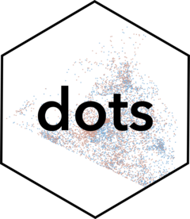

<!-- README.md is generated from README.Rmd. Please edit that file -->

# dots 

<!-- badges: start -->

[](https://github.com/christopherkenny/dots/actions/workflows/R-CMD-check.yaml)
<!-- badges: end -->

`dots` provides tools to make dot density maps.

## Installation

You can install the development version of dots from
[GitHub](https://github.com/) with:

``` r
# install.packages("devtools")
devtools::install_github("christopherkenny/dots")
```

## Example

The main function in `dots` is `dots()`.

``` r
library(dots)
library(sf)
#> Linking to GEOS 3.9.1, GDAL 3.4.3, PROJ 7.2.1; sf_use_s2() is TRUE
data("suffolk")
dots::dots(suffolk, c(pop_black, pop_white)) + 
  ggplot2::scale_color_viridis_d() + 
  ggplot2::theme_void()
```
