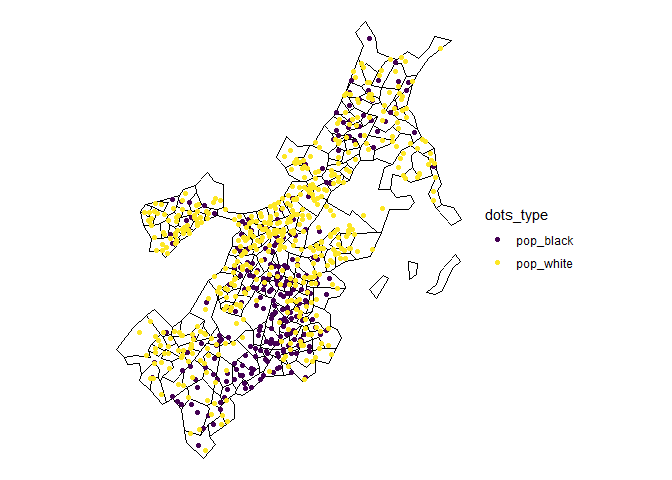
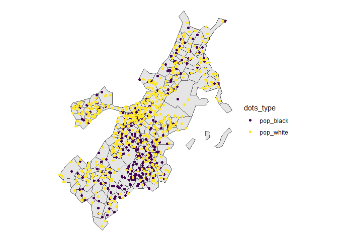

# dots

`dots` provides tools to make dot density maps.

## Installation

You can install the stable version of `dots` from CRAN with:

``` r

install.packages('dots')
```

You can install the development version of `dots` from
[GitHub](https://github.com/) with:

``` r

remotes::install_github('christopherkenny/dots')
```

## Example

The main function in `dots` is
[`dots()`](http://christophertkenny.com/dots/reference/dots.md).

``` r

library(dots)
library(sf)
#> Linking to GEOS 3.13.1, GDAL 3.11.0, PROJ 9.6.0; sf_use_s2() is TRUE
library(ggplot2)
data('suffolk')
dots::dots(suffolk, c(pop_black, pop_white), divisor = 1000, engine = engine_sf_random) + 
  scale_color_viridis_d() + 
  theme_void()
```



You can also use
[`dots_points()`](http://christophertkenny.com/dots/reference/dots_points.md)
to only make the randomized points.

``` r

dots::dots_points(suffolk, c(pop_black, pop_white), divisor = 1000, engine = engine_sf_random) |> 
  ggplot() + 
  geom_sf(data = suffolk) + 
  geom_sf(aes(color = dots_type)) + 
  scale_color_viridis_d() + 
  theme_void()
```


